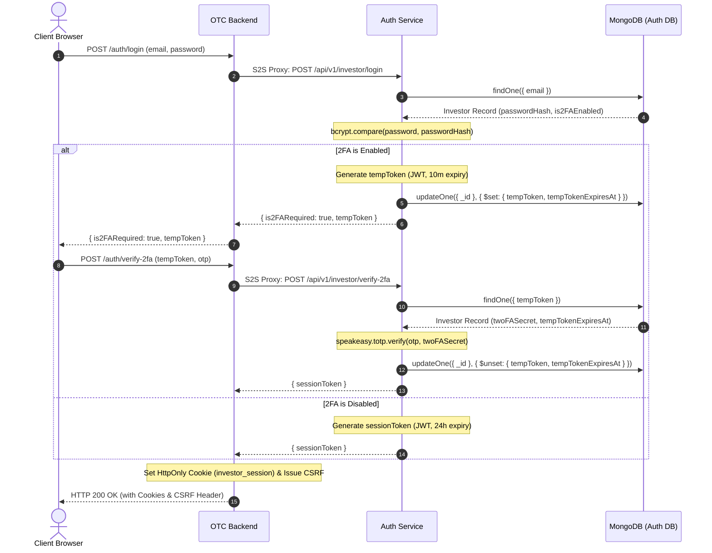
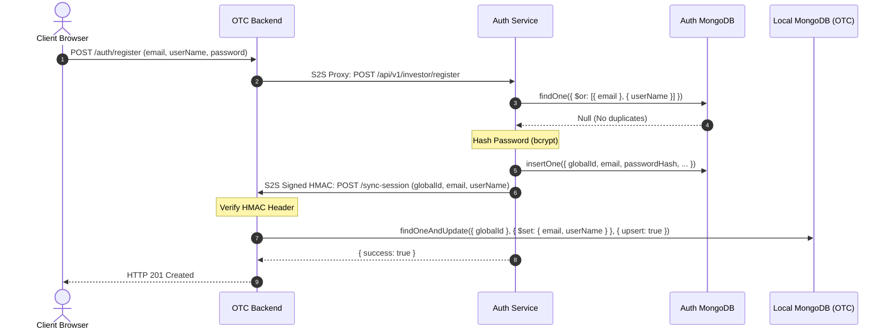
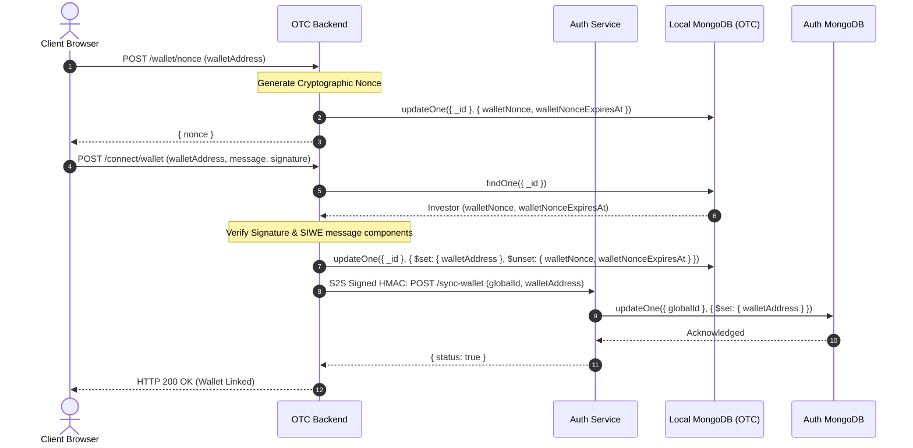
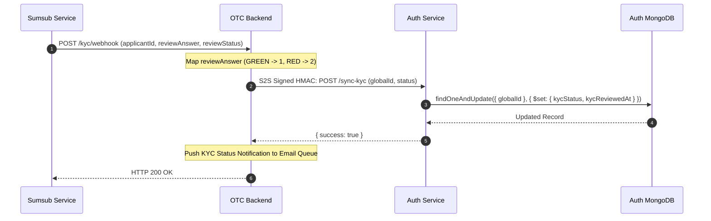
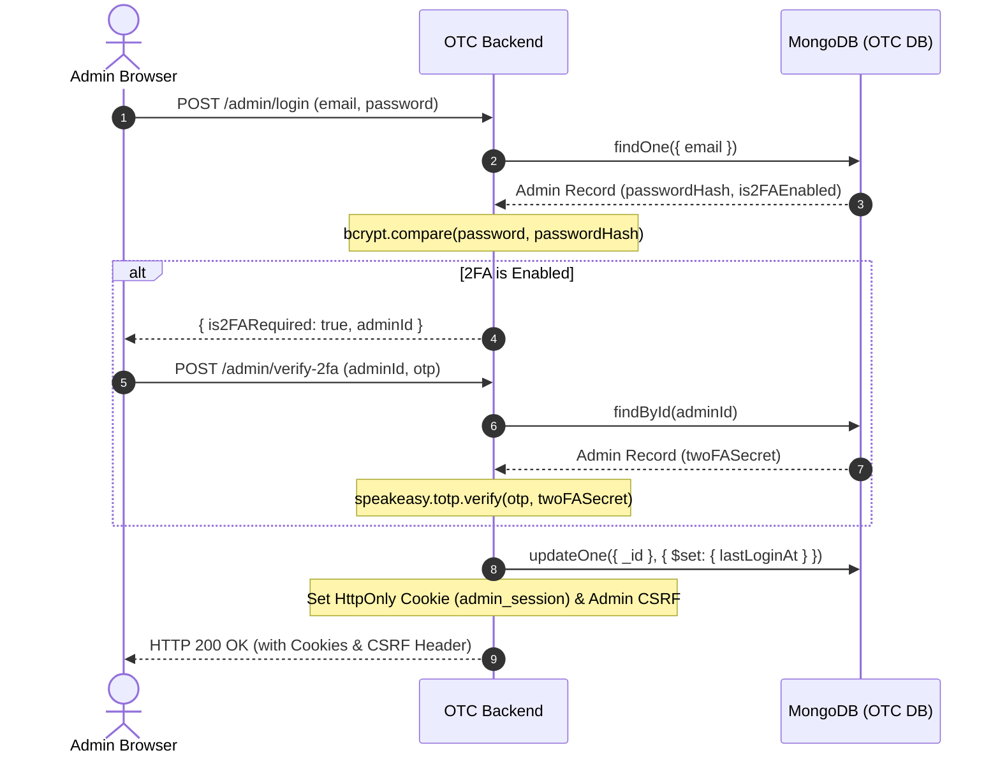
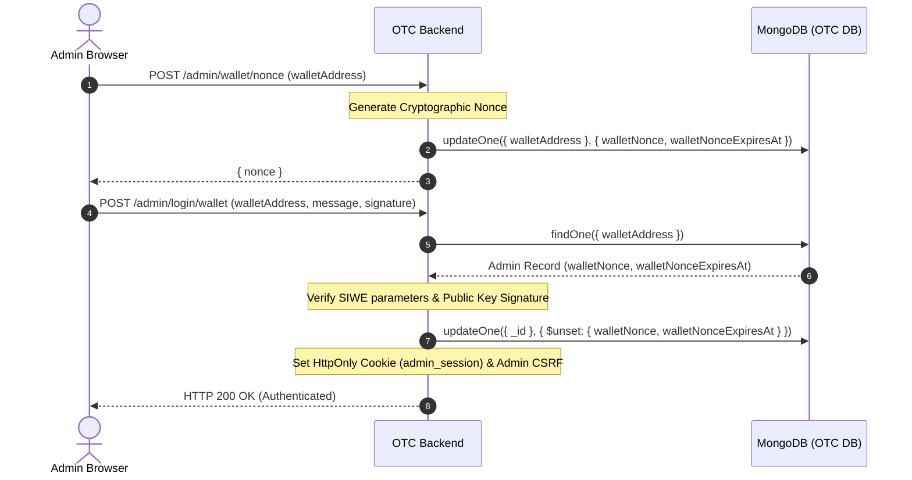
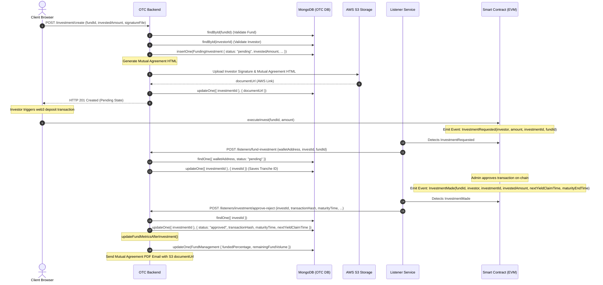
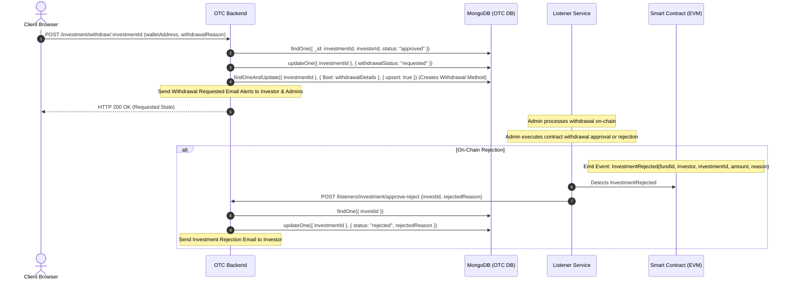

# NRX OTC Database Storage Flow Documentation

This document provides a comprehensive, end-to-end technical reference for the data lifecycles, cross-service synchronization, and blockchain event processing layers across the NRX Over-the-Counter (OTC) platform services:
*   `nrx-auth-service`
*   `nrx-otc-backend`
*   `nrx-otc-contract-backend`

---

## Master Persistence & CRUD Mappings (OTC Platform)

The following master reference table maps every database operation described in the flows below, linking incoming client endpoints to MongoDB collection queries/updates, microservice boundaries, and blockchain events.

| Flow / Endpoint | Microservice Boundary | MongoDB Collection | CRUD Operation | Key Database Fields | Blockchain Event / Queue |
| :--- | :--- | :--- | :--- | :--- | :--- |
| **Investor Login** (POST `/api/v1/investor/auth/login`) | Client -> OTC Backend -> Auth Service | `investors` (Auth DB) | Read | `email`, `passwordHash`, `tempToken`, `tempTokenExpiresAt`, `is2FAEnabled` | None |
| **Verify Login 2FA** (POST `/api/v1/investor/auth/verify-2fa`) | Client -> OTC Backend -> Auth Service | `investors` (Auth DB) | Read & Update | Read: `tempToken` \| Update: `tempToken` (nullified) | None |
| **Investor Registration** (POST `/api/v1/investor/auth/register`) | Client -> OTC Backend -> Auth Service | `investors` (Auth DB), `investors` (OTC DB) | Insert (Auth) / S2S Sync (OTC) | Insert: `email`, `userName`, `passwordHash`, `globalId` \| S2S: `globalId`, `userName`, `email` | None |
| **SIWE Nonce** (POST `/api/v1/investor/wallet/nonce`) | Client -> OTC Backend | `investors` (OTC DB) | Update | `walletNonce`, `walletNonceExpiresAt` | None |
| **SIWE Verification** (POST `/api/v1/investor/connect/wallet`) | Client -> OTC Backend -> Auth Service | `investors` (OTC DB), `investors` (Auth DB) | Update (OTC) / S2S Sync (Auth) | Update: `walletAddress` \| S2S: `walletAddress` synced to Auth Service | None |
| **Sumsub KYC Webhook** (POST `/api/v1/admin/kyc/webhook`) | Sumsub -> OTC Backend -> Auth Service | `investors` (Auth DB) | Update | `kycStatus`, `kycReviewedAt` | None |
| **Admin Login & 2FA** (POST `/api/v1/admin/login`) | Client -> OTC Backend | `admins` (OTC DB) | Read & Update | Read: `email`, `passwordHash`, `twoFASecret` \| Update: `lastLoginAt` | None |
| **Admin Wallet Auth** (POST `/api/v1/admin/login/wallet`) | Client -> OTC Backend | `admins` (OTC DB) | Read & Update | Read: `walletAddress`, `walletNonce` \| Update: `walletNonce` (nullified) | None |
| **OTC Investment Create** (POST `/api/v1/investor/investment/create`) | Client -> OTC Backend | `fundinginvestments` | Insert & Update | Insert: `investorId`, `fundId`, `investedAmount`, `status` (pending) | AWS S3 Upload (Mutual Agreement PDF) |
| **OTC Investment Event** (`/fund-investment`) | Listener -> OTC Backend | `fundinginvestments` | Update | `investId` (stores on-chain tranche ID) | `InvestmentRequested` (Contract) |
| **OTC Investment Approve** (`/investment/approve-reject`) | Listener -> OTC Backend | `fundinginvestments`, `fundmanagements` | Update (Investment) / Update (Fund) | Investment: `status` (approved), `transactionHash`, `maturityTime`, `nextYieldClaimTime` \| Fund: `fundedPercentage`, `remainingFundVolume` | `InvestmentMade` (Contract) |
| **OTC Withdraw Request** (POST `/withdraw/:investmentId`) | Client -> OTC Backend | `fundinginvestments`, `investmentwithdrawalmethods` | Update (Investment) / Upsert (Method) | Investment: `withdrawalStatus` (requested) | None |
| **Block Checkpoint** (`/block-checkpoint`) | Listener -> OTC Backend | `listenerblockcheckpoints` | Update ($max) | `blockNumber` (atomic monotonic update) | None |

---

## 1. Authentication & Sync Flows

### 1.1 Investor Login & JWT Handoff Flow

The OTC backend delegates credentials verification to the centralized `nrx-auth-service`.

#### Data Flow & Mappings
1. **Client API Request**: Client submits credentials to the OTC backend:
   * **Endpoint**: `POST /api/v1/investor/auth/login` (Controller: `AuthInvestorController.login`)
   * **DTO & Validation**: `LoginAuthInvestorDto` (fields: `email`, `password`).
2. **S2S Proxy Call**: The OTC service routes the payload to `nrx-auth-service` via a secure HTTPS S2S POST request:
   * **Auth Endpoint**: `POST /api/v1/investor/login` (Controller: `InvestorController.login`).
3. **Database Read (Auth Service)**: 
   * **Service**: `InvestorService.login`
   * **MongoDB Operation**: `findOne` on `Investor` collection (in Auth DB) matching the verified `email`.
   * **Credentials Verification**: Performs `bcrypt.compare` between input password and the stored `passwordHash`.
4. **JWT & 2FA State Routing**:
   * If **2FA is disabled**: Returns `sessionToken` (expires in 24 hours), `is2FARequired: false`, and the `Investor` document fields.
   * If **2FA is enabled**: Generates a short-lived `tempToken` (JWT expiring in 10 minutes containing the investor's `globalId`), sets `is2FARequired: true`, and updates the database:
     * **MongoDB Operation**: `updateOne` on the `Investor` collection.
     * **Fields Updated**: `tempToken` (stored string hash) and `tempTokenExpiresAt`.
5. **2FA Verification Endpoints (If 2FA is active)**:
   * Client presents OTP and `tempToken` to the OTC backend, which proxies to `nrx-auth-service`:
     * **Auth Endpoint**: `POST /api/v1/investor/verify-2fa` (Controller: `InvestorController.verify2FA`)
     * **DTO**: `Verify2FAInvestorDto` (`tempToken`, `otpCode`).
     * **MongoDB Operation**: `findOne` on `Investor` collection matching `tempToken` and checks that `tempTokenExpiresAt` > current time.
     * **Verification**: Verifies OTP against the stored `twoFASecret` using `speakeasy.totp.verify`.
     * **MongoDB Operation (Post-Verification)**: `updateOne` to nullify `tempToken` and `tempTokenExpiresAt` to prevent replay attacks.
6. **Cookie Setting**: The OTC controller intercepts the returning `sessionToken` from Auth Service and writes it as an `HttpOnly`, `Secure`, `SameSite=Lax` cookie named `investor_session` directly to the client's express response header, while also issuing a CSRF token.



---

### 1.2 Investor Registration Flow

Registration coordinates account creation across the central Identity database and local business database engine (OTC), maintaining schema segregation.

#### Data Flow & Mappings
1. **Client API Request**: Client submits registration details:
   * **OTC Endpoint**: `POST /api/v1/investor/auth/register` (Controller: `AuthInvestorController.register`)
   * **DTO**: `RegisterAuthInvestorDto` (fields: `email`, `userName`, `password`).
2. **S2S Handoff**: OTC sends a secure POST to `nrx-auth-service`:
   * **Auth Endpoint**: `POST /api/v1/investor/register` (Controller: `InvestorController.register`).
3. **Database Insertion (Auth Service)**:
   * **Service**: `InvestorService.register`
   * **Duplicate Verification**: Executes `findOne` on `Investor` (Auth DB) to confirm neither `email` nor `userName` exists.
   * **Password Hashing**: `bcrypt.hash` with salt rounds = 10.
   * **MongoDB Operation**: `insertOne` on the `Investor` collection (Auth DB).
   * **Fields Populated**: `email`, `userName`, `passwordHash`, `globalId` (auto-generated UUID), `is2FAEnabled: false`.
4. **S2S Synchronous Downstream Propagation**:
   * Auth Service broadcasts account generation to OTC service.
   * **Propagation Call**: Signs an HMAC-SHA256 signature containing `globalId`, `userName`, and `email`, and sends a POST to:
     * **OTC Sync API**: `POST /api/v1/listeners/sync-session`
   * **Signature Verification**: Receivers calculate the HMAC using the local shared S2S secret (e.g., `S2S_NRX_OTC_KEY`) and check it against the incoming signature in the headers.
   * **Local MongoDB Operation**: `findOneAndUpdate` with `{ globalId }` and `{ upsert: true }` on the local `Investor` collection.
   * **Fields Populated**: `globalId`, `userName`, `email`.



---

### 1.3 SIWE Wallet Connection Flow

The platform relies on Sign-in with Ethereum (SIWE) to verify blockchain ownership, linking local investor profiles to decentralized wallet addresses.

#### Data Flow & Mappings
1. **Nonce Generation**:
   * **Endpoint**: `POST /api/v1/investor/wallet/nonce` (Controller: `AuthInvestorController.getWalletNonce`)
   * **DTO**: `GetNonceInvestorDto` (`walletAddress`).
   * **MongoDB Operation**: `updateOne` on the local `Investor` collection.
   * **Fields Updated**: `walletNonce` (randomly generated cryptographically secure string) and `walletNonceExpiresAt` (expiry set to 5 minutes).
   * **Return**: Nonce returned to the client.
2. **Signature Verification & Connection**:
   * **Endpoint**: `POST /api/v1/investor/connect/wallet` (Controller: `AuthInvestorController.connectWallet`)
   * **DTO**: `LoginWalletInvestorDto` (fields: `walletAddress`, `message`, `signature`).
   * **Validation (SIWE parser)**:
     * Parses the SIWE message.
     * Verifies the nonce in the message matches the stored `walletNonce` on the database.
     * Confirms the domain/origin matches the platform's configuration limits (`SIWE_ALLOWED_DOMAINS`).
     * Validates that the chain ID is allowlisted (`SIWE_ALLOWED_CHAIN_IDS`).
     * Verifies signature authenticity using `ethers.verifyMessage` matching the public `walletAddress`.
3. **Database Updates & Sync**:
   * **Local MongoDB Operation**: `findOneAndUpdate` on local `Investor` collection matching investor `_id`.
   * **Fields Updated**: Sets `walletAddress` (normalized to lowercase), clears `walletNonce` and `walletNonceExpiresAt`.
   * **S2S Sync Call**: Invokes `nrx-auth-service` via secure HMAC-signed request:
     * **Endpoint**: `POST /api/v1/investor/sync-wallet` (Controller: `InvestorController.internalSyncWallet`).
     * **Auth MongoDB Operation**: `updateOne` on the central `Investor` collection.
     * **Fields Updated**: `walletAddress` mapped to `globalId`.



---

### 1.4 Sumsub KYC Webhook Flow

KYC verification status changes are pushed asynchronously by Sumsub via webhooks, parsed by the backends, and synced globally.

#### Data Flow & Mappings
1. **External Webhook Trigger**: Sumsub triggers a verification response to the listener endpoint:
   * **Endpoint**: `POST /api/v1/admin/kyc/webhook` (Controller: `SumsubWebhookController.handleWebhook`)
2. **Local Processing**:
   * **Service**: `AuthAdminService.updateKYCStatus`
   * **Validation**: Extracts `reviewStatus` and `reviewResult.reviewAnswer`.
   * **Status Code Mapping**:
     * `GREEN` (Answer: `GREEN`) -> Internal code `1` (Approved)
     * `RED` (Answer: `RED`) -> Internal code `2` (Rejected)
3. **S2S Synchronization**:
   * **Request**: OTC posts status change to Auth Service via HMAC-signed payload:
     * **Endpoint**: `POST /api/v1/investor/sync-kyc`
   * **Auth MongoDB Operation**: `findOneAndUpdate` matching the investor's `globalId`.
   * **Fields Updated**: `kycStatus` (updated to `1` or `2`), `kycReviewedAt` (current timestamp).
4. **Alerts & Notifications**:
   * **Queue**: The local service sends a notification email to the investor (using `EmailHelper` or pushing to the redis `EmailQueueService`) notifying them of approval or rejection.



---

## 2. Admin & Security Flows

### 2.1 Admin Login & 2FA Flow

Administrators access management features via standard password verification coupled with strict 2FA configurations.

#### Data Flow & Mappings
1. **Client API Request**: Admin submits login payload:
   * **Endpoint**: `POST /api/v1/admin/login` (Controller: `AuthAdminController.login`)
   * **DTO**: `LoginAuthAdminDto` (`email`, `password`).
2. **Database Verification (Local Business DB)**:
   * **Service**: `AuthAdminService.login`
   * **MongoDB Operation**: `findOne` on local `Admin` collection matching `email`.
   * **Credentials Verification**: Executes `bcrypt.compare` against the stored `passwordHash`.
3. **2FA State Routing**:
   * If **2FA is enabled**: Generates short-lived `tempToken`, returns `is2FARequired: true`.
   * If **2FA is disabled**: Returns `sessionToken` directly.
4. **2FA OTP Code Submission**:
   * **Endpoint**: `POST /api/v1/admin/verify-2fa` (Controller: `AuthAdminController.verify2FA`)
   * **Payload**: `adminId`, `otp`.
   * **MongoDB Operation**: `findById` on local `Admin` collection.
   * **TOTP Verification**: Validates `otp` using `speakeasy.totp.verify` against `twoFASecret`.
5. **Database Updates**:
   * **MongoDB Operation**: `updateOne` on the `Admin` document.
   * **Fields Updated**: Updates `lastLoginAt` timestamp.
6. **Cookie Setting**: Controller calls `setAdminAuthCookie` and issues an admin CSRF token.



---

### 2.2 Admin Wallet Authentication Flow

Administrators can link blockchain wallets to their profiles and authenticate securely using SIWE.

#### Data Flow & Mappings
1. **Nonce Request**:
   * **Endpoint**: `POST /api/v1/admin/wallet/nonce` (Controller: `AuthAdminController.getWalletNonce`)
   * **DTO**: `GetNonceAdminDto` (`walletAddress`).
   * **MongoDB Operation**: `updateOne` on the `Admin` collection.
   * **Fields Updated**: Sets `walletNonce` and `walletNonceExpiresAt`.
2. **Signature Verification & SIWE Verification**:
   * **Endpoint**: `POST /api/v1/admin/login/wallet` (Controller: `AuthAdminController.loginWithWallet`)
   * **DTO**: `LoginWalletAdminDto` (`walletAddress`, `message`, `signature`).
   * **MongoDB Operation**: `findOne` matching `walletAddress` (normalized to lowercase).
   * **Validation**: Extracts nonce from message, confirms it matches the stored `walletNonce` on DB, checks signature verification, and nullifies the nonce fields via `updateOne`.
3. **Session Generation**: Issues the cookie `admin_session` and CSRF tokens.



---

## 3. OTC Investment Lifecycle

The OTC platform handles private debt/fund shares investments, starting with offline/Web2 signature commitments before locking assets on-chain.

### 3.1 OTC Investment Lifecycle (Buy/Deposit)



#### Detailed Operations & Mappings
1. **Creation Endpoint**: 
   * **Endpoint**: `POST /api/v1/investor/investment/create` (Controller: `InvestmentController.create`)
   * **DTO**: `CreateInvestmentDto` (fields: `fundId`, `investedAmount`, `totalAmount`).
   * **File Upload**: Signature image parsed by NestJS `FileInterceptor` and validated using `imageUploadInterceptorOptions`.
2. **Database Verification**:
   * Reads from `FundManagement` to confirm the fund exists.
   * Reads from local `Investor` to confirm the investor profile exists.
3. **Database Write**:
   * **MongoDB Operation**: `insertOne` on the `fundinginvestments` collection.
   * **Initial State**: `status` is hardcoded to `pending`, and `investedAmount` is set from the DTO.
4. **Mutual Agreement Generation**:
   * **Upload Signature**: Uploads the signature file to AWS S3 using `uploadImageToS3`.
   * **HTML Render**: Renders the agreement using `renderTemplate('mutual-agreement')`, passing variables (e.g., investor name, fund entity, invested amount, and S3 signature link).
   * **PDF Upload**: Uploads HTML output to S3 using `uploadHtmlToS3` returning `documentUrl`.
   * **MongoDB Operation**: `updateOne` on the `fundinginvestments` record to save the `documentUrl`.
   * **Initial Email Alerts**: Sends a confirmation email to the investor and an approval request email to the platform administrator.
5. **Blockchain Interactions & Listening**:
   * **Blockchain Event `InvestmentRequested`**: Emitted when the investor executes the deposit transaction on the blockchain. Contains: `investor` address, `amount`, `investmentId` (the on-chain tranche ID), and `fundId`.
   * **Listener Action**: `InvestmentListener.handleInvestmentEvent` intercepts the event, pauses 10 seconds to avoid database conflict writes, and calls the API:
     * **API Call**: `POST /api/v1/listeners/fund-investment` (Controller: `ListenerController.fundInvestment`)
     * **DTO**: `FundInvestmentDto` (`walletAddress`, `investId`, `fundId`, `totalAmount`).
     * **MongoDB Operation**: Searches `fundinginvestments` matching investor/fund/`status: pending` where `investId` is not yet defined, and updates the document.
     * **Field Updated**: Sets `investId` to the on-chain `investmentId` value.
   * **Blockchain Event `InvestmentMade`**: Emitted when the administrator approves the investment on-chain.
   * **Listener Action**: `InvestmentListener.handleInvestmentApprovedEvent` intercepts the event and posts to:
     * **API Call**: `POST /api/v1/listeners/investment/approve-reject` (Controller: `ListenerController.investmentApproveReject`)
     * **DTO**: `InvestmentApproveRejectDto` (`investId`, `transactionHash`, `walletAddress`, `investedAmount`, `nextYieldClaimTime`, `maturityTime`).
     * **MongoDB Operation**: Searches `fundinginvestments` by `investId` and updates status:
       * **Fields Updated**: `status` -> `approved`, `transactionHash`, `maturityTime`, `nextYieldClaimTime` (array of claimable timestamps).
     * **Metrics Updates**: Recalculates statistics via `updateFundMetricsAfterInvestment`:
       * **MongoDB Operation**: `updateOne` on the associated `FundManagement` document, adjusting `fundedPercentage`, `remainingFundVolume`, and updating state to `Closing Soon` or `Closed` depending on limit thresholds.
     * **Verification Email**: Sends a final transaction confirmation email to the investor containing the S3 agreement link (`documentUrl`).

---

### 3.2 OTC Withdrawal Lifecycle

Investors can request withdrawals, which are evaluated by the platform administrator and processed through smart contract calls.



#### Detailed Operations & Mappings
1. **Withdrawal Request**:
   * **Endpoint**: `POST /api/v1/investor/investment/withdraw/:investmentId` (Controller: `InvestmentController.withdraw`)
   * **DTO**: `WithdrawalInvestmentDto` (`walletAddress`, `bankName`, `iban`, `swiftCode`, `withdrawalMethod`).
   * **MongoDB Operations**:
     * Performs `findOne` on `fundinginvestments` matching the `investmentId`, `investorId`, and verified `status: approved`.
     * Performs `updateOne` on the investment record, setting `withdrawalStatus` to `requested`.
     * Performs `findOneAndUpdate` on the `investmentwithdrawalmethods` collection (using `{ upsert: true }`) to save bank details mapped to the investment.
   * **Notification**: Dispatches notification emails immediately to the investor and the site administrator.
2. **On-Chain Reject processing**:
   * **Blockchain Event `InvestmentRejected`**: Triggered on-chain during manual administrative reject.
   * **Listener Action**: `InvestmentListener.handleInvestmentRejectedEvent` intercepts and triggers:
     * **API Call**: `POST /api/v1/listeners/investment/approve-reject`
     * **MongoDB Operation**: `updateOne` on the `fundinginvestments` record.
     * **Fields Updated**: `status` -> `rejected`, `rejectedReason` set to the on-chain string.
     * **Notification**: Sends rejection notification email containing the reason.

---

## 4. Event Listening & Checkpoints

### 4.1 OTC Blockchain Listener & Checkpoint Flow

The OTC platform uses a stateless listener `nrx-otc-contract-backend` to monitor blockchain events, process them sequentially via `nrx-otc-backend`, and persist progress via checkpoints.

```mermaid
flowchart TD
    subgraph EVM Chain
        Event[Contract Event Emitted]
    end

    subgraph Stateless OTC Contract Listener
        Listen[BaseListener Service] -->|Intercepts Event| Parse[Extract eventData & blockNumber]
        Parse -->|Sign HMAC Header| HTTPPost[HTTP POST API Call]
    end

    subgraph Core OTC Business Backend
        HTTPPost -->|Arrives at Controller| CheckConflict{HTTP 200 or 500?}
        
        CheckConflict -->|500 Server Error| Queue[Durable Queue Service]
        Queue -->|Enqueue MongoDB| QueueDB[(MongoDB Queue Collection)]
        QueueDB -->|Cron Retries| HTTPPost
        
        CheckConflict -->|200 OK| Process[Execute Service logic & updates]
        Process -->|Sync DB| CoreDB[(MongoDB Core Collections)]
        
        Process -->|Atomically Update Checkpoint| UpdateCheck[Update Checkpoint document]
        UpdateCheck -->|$max: { blockNumber }| CheckpointDB[(listenerblockcheckpoints)]
    end

    Event -.-> Listen
```

#### Detailed Operations & Mappings
1. **Stateless Event Processing**:
   * The listener backend `nrx-otc-contract-backend` monitors EVM contract events.
   * It extracts `eventData`, `transactionHash`, and `blockNumber` and posts it to the core OTC backend using HMAC-SHA256 headers.
2. **Durable Queuing & Error Resilience**:
   * If `nrx-otc-backend` returns an error, the payload is captured by the `DurableQueueService` and written to the local `durablequeues` collection for cron retry.
3. **Monotonic Checkpoint Updates**:
   * The checkpoint collection `listenerblockcheckpoints` is updated atomically using a `$max` query on the `blockNumber`.
4. **WebSocket Replay Recovery**:
   * On reconnection, the listener retrieves the stored checkpoint block from `nrx-otc-backend` and queries historical blocks to bridge the downtime gap.
