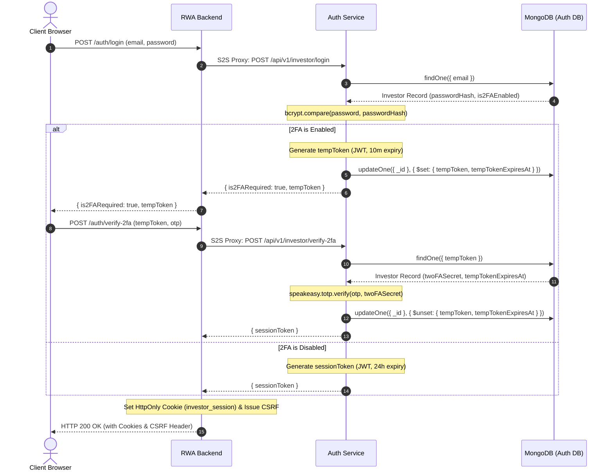
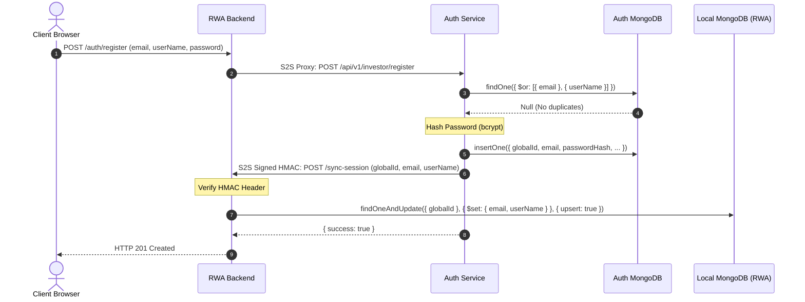
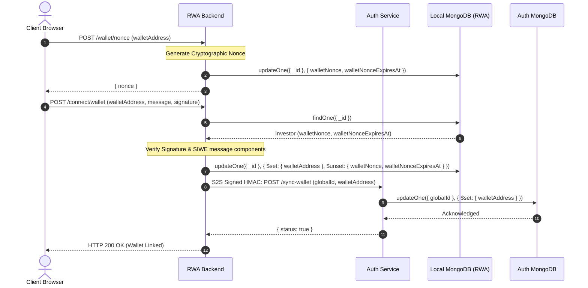
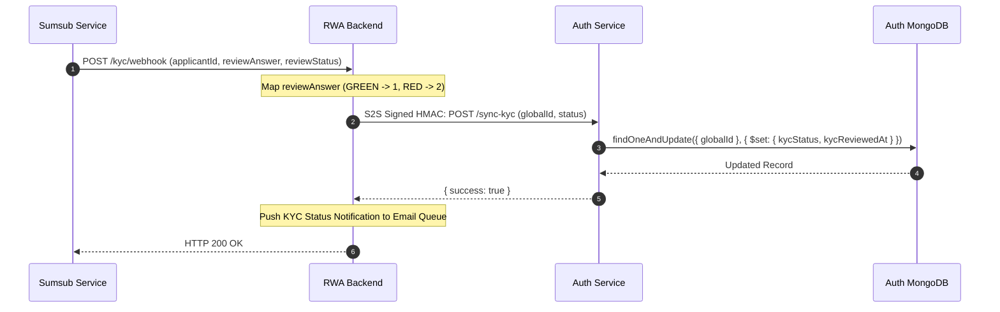
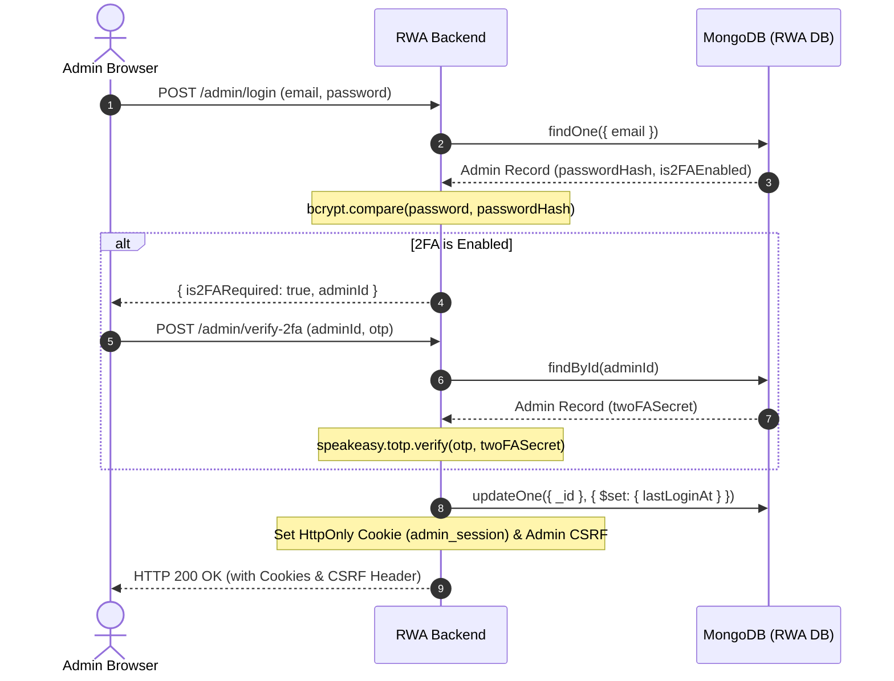
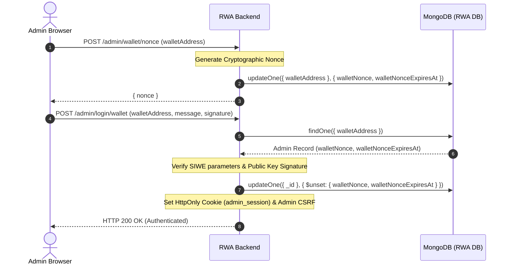
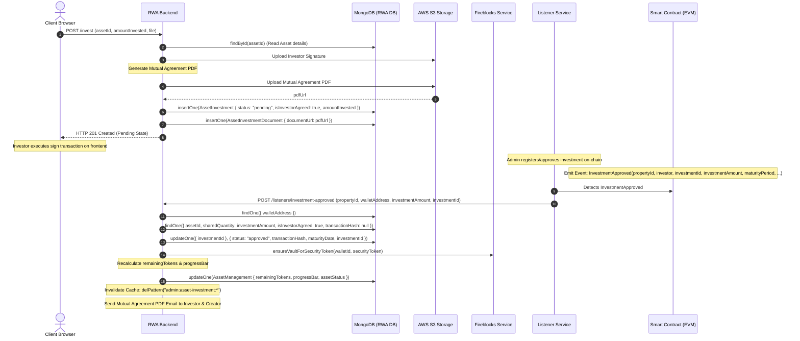
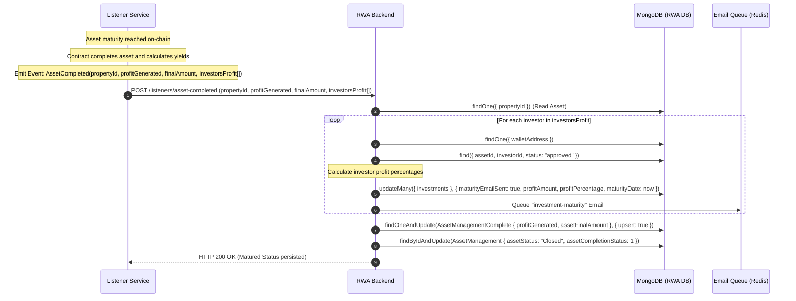
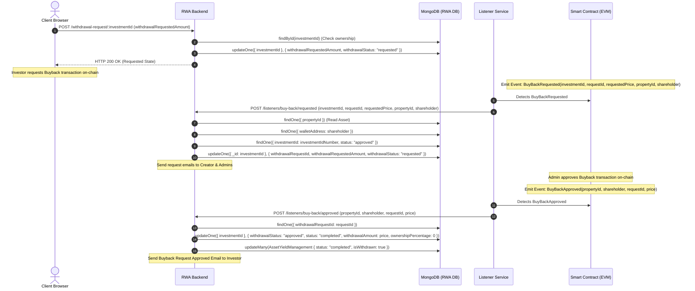

# NRX RWA Database Storage Flow Documentation

This document provides a comprehensive, end-to-end technical reference for the data lifecycles, cross-service synchronization, and blockchain event processing layers across the NRX Real World Asset (RWA) platform services:
*   `nrx-auth-service`
*   `nrx-rwa-backend`
*   `nrx-rwa-contract-backend`

---

## Master Persistence & CRUD Mappings (RWA Platform)

The following master reference table maps every database operation described in the flows below, linking incoming client endpoints to MongoDB collection queries/updates, microservice boundaries, and blockchain events.

| Flow / Endpoint | Microservice Boundary | MongoDB Collection | CRUD Operation | Key Database Fields | Blockchain Event / Queue |
| :--- | :--- | :--- | :--- | :--- | :--- |
| **Investor Login** (POST `/api/v1/investor/auth/login`) | Client -> RWA Backend -> Auth Service | `investors` (Auth DB) | Read | `email`, `passwordHash`, `tempToken`, `tempTokenExpiresAt`, `is2FAEnabled` | None |
| **Verify Login 2FA** (POST `/api/v1/investor/auth/verify-2fa`) | Client -> RWA Backend -> Auth Service | `investors` (Auth DB) | Read & Update | Read: `tempToken` \| Update: `tempToken` (nullified) | None |
| **Investor Registration** (POST `/api/v1/investor/auth/register`) | Client -> RWA Backend -> Auth Service | `investors` (Auth DB), `investors` (RWA DB) | Insert (Auth) / S2S Sync (RWA) | Insert: `email`, `userName`, `passwordHash`, `globalId` \| S2S: `globalId`, `userName`, `email` | None |
| **SIWE Nonce** (POST `/api/v1/investor/wallet/nonce`) | Client -> RWA Backend | `investors` (RWA DB) | Update | `walletNonce`, `walletNonceExpiresAt` | None |
| **SIWE Verification** (POST `/api/v1/investor/connect/wallet`) | Client -> RWA Backend -> Auth Service | `investors` (RWA DB), `investors` (Auth DB) | Update (RWA) / S2S Sync (Auth) | Update: `walletAddress` \| S2S: `walletAddress` synced to Auth Service | None |
| **Sumsub KYC Webhook** (POST `/api/v1/admin/kyc/webhook`) | Sumsub -> RWA Backend -> Auth Service | `investors` (Auth DB) | Update | `kycStatus`, `kycReviewedAt` | None |
| **Admin Login & 2FA** (POST `/api/v1/admin/login`) | Client -> RWA Backend | `admins` (RWA DB) | Read & Update | Read: `email`, `passwordHash`, `twoFASecret` \| Update: `lastLoginAt` | None |
| **Admin Wallet Auth** (POST `/api/v1/admin/login/wallet`) | Client -> RWA Backend | `admins` (RWA DB) | Read & Update | Read: `walletAddress`, `walletNonce` \| Update: `walletNonce` (nullified) | None |
| **RWA Investment Create** (POST `/invest`) | Client -> RWA Backend | `assetinvestments`, `assetinvestmentdocuments` | Insert (Investment) / Insert (Document) | Investment: `investorId`, `assetId`, `amountInvested`, `isInvestorAgreed` | S3 Upload (Signature & Agreement PDF) |
| **RWA Investment Approve** (`/investment-approved`) | Listener -> RWA Backend | `assetinvestments`, `assetmanagements` | Update (Investment) / Update (Asset) | Investment: `status` (approved), `transactionHash`, `maturityDate`, `investmentId` \| Asset: `remainingTokens`, `progressBar` | Fireblocks Vault Sync |
| **RWA Asset Completion** (`/asset-completed`) | Listener -> RWA Backend | `assetinvestments`, `assetmanagements`, `assetmanagementcompletes` | Update (Investment) / Update (Asset) / Upsert (Complete) | Investment: `maturityEmailSent`, `profitAmount`, `profitPercentage` \| Asset: `assetStatus` (Closed), `assetCompletionStatus` (1) | Email Queue (Redis) |
| **RWA Buyback Request** (`/buy-back/requested`) | Listener -> RWA Backend | `assetinvestments` | Update | `withdrawalRequestId`, `withdrawalRequestedAmount`, `withdrawalStatus` (requested) | None |
| **RWA Buyback Approve** (`/buy-back/approved`) | Listener -> RWA Backend | `assetinvestments`, `assetyieldmanagements` | Update (Investment) / Update (Yields) | Investment: `withdrawalStatus` (approved), `status` (completed), `ownershipPercentage` (0) | None |
| **RWA Asset Yield** (`/asset-yield`) | Listener -> RWA Backend | `assetyieldmanagements` | Upsert | `netAmount`, `yieldMonth`, `yieldYear`, `status`, `isYieldClosed`, `sharesHolding` | `getClaimableIncome` (Contract) |
| **RWA Yield Claim** (`/asset-withdrawal`) | Listener -> RWA Backend | `assetyieldmanagements` | Update & Upsert | Update: `isWithdrawn` (true) on rental yields \| Upsert: `netAmount`, `yieldType` (withdraw) | None |
| **Block Checkpoint** (`/block-checkpoint`) | Listener -> RWA Backend | `listenerblockcheckpoints` | Update ($max) | `blockNumber` (atomic monotonic update) | None |

---

## 1. Authentication & Sync Flows

### 1.1 Investor Login & JWT Handoff Flow

The RWA backend delegates credentials verification to the centralized `nrx-auth-service`.

#### Data Flow & Mappings
1. **Client API Request**: Client submits credentials to the RWA backend:
   * **Endpoint**: `POST /api/v1/investor/auth/login` (Controller: `AuthInvestorController.login`)
   * **DTO & Validation**: `LoginAuthInvestorDto` (fields: `email`, `password`).
2. **S2S Proxy Call**: The RWA service routes the payload to `nrx-auth-service` via a secure HTTPS S2S POST request:
   * **Auth Endpoint**: `POST /api/v1/investor/login` (Controller: `InvestorController.login`).
3. **Database Read (Auth Service)**: 
   * **Service**: `InvestorService.login`
   * **MongoDB Operation**: `findOne` on `Investor` collection (in Auth DB) matching the verified `email`.
   * **Credentials Verification**: Performs `bcrypt.compare` between input password and the stored `passwordHash`.
4. **JWT & 2FA State Routing**:
   * If **2FA is disabled**: Returns `sessionToken` (expires in 24 hours), `is2FARequired: false`, and the `Investor` document fields.
   * If **2FA is enabled**: Generates a short-lived `tempToken` (JWT expiring in 10 minutes containing the investor's `globalId`), sets `is2FARequired: true`, and updates the database:
     * **MongoDB Operation**: `updateOne` on the `Investor` collection.
     * **Fields Updated**: `tempToken` (stored string hash) and `tempTokenExpiresAt`.
5. **2FA Verification Endpoints (If 2FA is active)**:
   * Client presents OTP and `tempToken` to the RWA backend, which proxies to `nrx-auth-service`:
     * **Auth Endpoint**: `POST /api/v1/investor/verify-2fa` (Controller: `InvestorController.verify2FA`)
     * **DTO**: `Verify2FAInvestorDto` (`tempToken`, `otpCode`).
     * **MongoDB Operation**: `findOne` on `Investor` collection matching `tempToken` and checks that `tempTokenExpiresAt` > current time.
     * **Verification**: Verifies OTP against the stored `twoFASecret` using `speakeasy.totp.verify`.
     * **MongoDB Operation (Post-Verification)**: `updateOne` to nullify `tempToken` and `tempTokenExpiresAt` to prevent replay attacks.
6. **Cookie Setting**: The RWA controller intercepts the returning `sessionToken` from Auth Service and writes it as an `HttpOnly`, `Secure`, `SameSite=Lax` cookie named `investor_session` directly to the client's express response header, while also issuing a CSRF token.



---

### 1.2 Investor Registration Flow

Registration coordinates account creation across the central Identity database and local business database engine (RWA), maintaining schema segregation.

#### Data Flow & Mappings
1. **Client API Request**: Client submits registration details:
   * **RWA Endpoint**: `POST /api/v1/investor/auth/register` (Controller: `AuthInvestorController.register`)
   * **DTO**: `RegisterAuthInvestorDto` (fields: `email`, `userName`, `password`).
2. **S2S Handoff**: RWA sends a secure POST to `nrx-auth-service`:
   * **Auth Endpoint**: `POST /api/v1/investor/register` (Controller: `InvestorController.register`).
3. **Database Insertion (Auth Service)**:
   * **Service**: `InvestorService.register`
   * **Duplicate Verification**: Executes `findOne` on `Investor` (Auth DB) to confirm neither `email` nor `userName` exists.
   * **Password Hashing**: `bcrypt.hash` with salt rounds = 10.
   * **MongoDB Operation**: `insertOne` on the `Investor` collection (Auth DB).
   * **Fields Populated**: `email`, `userName`, `passwordHash`, `globalId` (auto-generated UUID), `is2FAEnabled: false`.
4. **S2S Synchronous Downstream Propagation**:
   * Auth Service broadcasts account generation to RWA service.
   * **Propagation Call**: Signs an HMAC-SHA256 signature containing `globalId`, `userName`, and `email`, and sends a POST to:
     * **RWA Sync API**: `POST /api/v1/listeners/sync-session`
   * **Signature Verification**: Receivers calculate the HMAC using the local shared S2S secret (e.g., `S2S_NRX_RWA_KEY`) and check it against the incoming signature in the headers.
   * **Local MongoDB Operation**: `findOneAndUpdate` with `{ globalId }` and `{ upsert: true }` on the local `Investor` collection.
   * **Fields Populated**: `globalId`, `userName`, `email`.



---

### 1.3 SIWE Wallet Connection Flow

The platform relies on Sign-in with Ethereum (SIWE) to verify blockchain ownership, linking local investor profiles to decentralized wallet addresses.

#### Data Flow & Mappings
1. **Nonce Generation**:
   * **Endpoint**: `POST /api/v1/investor/wallet/nonce` (Controller: `AuthInvestorController.getWalletNonce`)
   * **DTO**: `GetNonceInvestorDto` (`walletAddress`).
   * **MongoDB Operation**: `updateOne` on the local `Investor` collection.
   * **Fields Updated**: `walletNonce` (randomly generated cryptographically secure string) and `walletNonceExpiresAt` (expiry set to 5 minutes).
   * **Return**: Nonce returned to the client.
2. **Signature Verification & Connection**:
   * **Endpoint**: `POST /api/v1/investor/connect/wallet` (Controller: `AuthInvestorController.connectWallet`)
   * **DTO**: `LoginWalletInvestorDto` (fields: `walletAddress`, `message`, `signature`).
   * **Validation (SIWE parser)**:
     * Parses the SIWE message.
     * Verifies the nonce in the message matches the stored `walletNonce` on the database.
     * Confirms the domain/origin matches the platform's configuration limits (`SIWE_ALLOWED_DOMAINS`).
     * Validates that the chain ID is allowlisted (`SIWE_ALLOWED_CHAIN_IDS`).
     * Verifies signature authenticity using `ethers.verifyMessage` matching the public `walletAddress`.
3. **Database Updates & Sync**:
   * **Local MongoDB Operation**: `findOneAndUpdate` on local `Investor` collection matching investor `_id`.
   * **Fields Updated**: Sets `walletAddress` (normalized to lowercase), clears `walletNonce` and `walletNonceExpiresAt`.
   * **S2S Sync Call**: Invokes `nrx-auth-service` via secure HMAC-signed request:
     * **Endpoint**: `POST /api/v1/investor/sync-wallet` (Controller: `InvestorController.internalSyncWallet`).
     * **Auth MongoDB Operation**: `updateOne` on the central `Investor` collection.
     * **Fields Updated**: `walletAddress` mapped to `globalId`.



---

### 1.4 Sumsub KYC Webhook Flow

KYC verification status changes are pushed asynchronously by Sumsub via webhooks, parsed by the backends, and synced globally.

#### Data Flow & Mappings
1. **External Webhook Trigger**: Sumsub triggers a verification response to the listener endpoint:
   * **Endpoint**: `POST /api/v1/admin/kyc/webhook` (Controller: `SumsubWebhookController.handleWebhook`)
2. **Local Processing**:
   * **Service**: `AuthAdminService.updateKYCStatus`
   * **Validation**: Extracts `reviewStatus` and `reviewResult.reviewAnswer`.
   * **Status Code Mapping**:
     * `GREEN` (Answer: `GREEN`) -> Internal code `1` (Approved)
     * `RED` (Answer: `RED`) -> Internal code `2` (Rejected)
3. **S2S Synchronization**:
   * **Request**: RWA posts status change to Auth Service via HMAC-signed payload:
     * **Endpoint**: `POST /api/v1/investor/sync-kyc`
   * **Auth MongoDB Operation**: `findOneAndUpdate` matching the investor's `globalId`.
   * **Fields Updated**: `kycStatus` (updated to `1` or `2`), `kycReviewedAt` (current timestamp).
4. **Alerts & Notifications**:
   * **Queue**: The local service sends a notification email to the investor (using `EmailHelper` or pushing to the redis `EmailQueueService`) notifying them of approval or rejection.



---

## 2. Admin & Security Flows

### 2.1 Admin Login & 2FA Flow

Administrators access management features via standard password verification coupled with strict 2FA configurations.

#### Data Flow & Mappings
1. **Client API Request**: Admin submits login payload:
   * **Endpoint**: `POST /api/v1/admin/login` (Controller: `AuthAdminController.login`)
   * **DTO**: `LoginAuthAdminDto` (`email`, `password`).
2. **Database Verification (Local Business DB)**:
   * **Service**: `AuthAdminService.login`
   * **MongoDB Operation**: `findOne` on local `Admin` collection matching `email`.
   * **Credentials Verification**: Executes `bcrypt.compare` against the stored `passwordHash`.
3. **2FA State Routing**:
   * If **2FA is enabled**: Generates short-lived `tempToken`, returns `is2FARequired: true`.
   * If **2FA is disabled**: Returns `sessionToken` directly.
4. **2FA OTP Code Submission**:
   * **Endpoint**: `POST /api/v1/admin/verify-2fa` (Controller: `AuthAdminController.verify2FA`)
   * **Payload**: `adminId`, `otp`.
   * **MongoDB Operation**: `findById` on local `Admin` collection.
   * **TOTP Verification**: Validates `otp` using `speakeasy.totp.verify` against `twoFASecret`.
5. **Database Updates**:
   * **MongoDB Operation**: `updateOne` on the `Admin` document.
   * **Fields Updated**: Updates `lastLoginAt` timestamp.
6. **Cookie Setting**: Controller calls `setAdminAuthCookie` and issues an admin CSRF token.



---

### 2.2 Admin Wallet Authentication Flow

Administrators can link blockchain wallets to their profiles and authenticate securely using SIWE.

#### Data Flow & Mappings
1. **Nonce Request**:
   * **Endpoint**: `POST /api/v1/admin/wallet/nonce` (Controller: `AuthAdminController.getWalletNonce`)
   * **DTO**: `GetNonceAdminDto` (`walletAddress`).
   * **MongoDB Operation**: `updateOne` on the `Admin` collection.
   * **Fields Updated**: Sets `walletNonce` and `walletNonceExpiresAt`.
2. **Signature Verification & SIWE Verification**:
   * **Endpoint**: `POST /api/v1/admin/login/wallet` (Controller: `AuthAdminController.loginWithWallet`)
   * **DTO**: `LoginWalletAdminDto` (`walletAddress`, `message`, `signature`).
   * **MongoDB Operation**: `findOne` matching `walletAddress` (normalized to lowercase).
   * **Validation**: Extracts nonce from message, confirms it matches the stored `walletNonce` on DB, checks signature verification, and nullifies the nonce fields via `updateOne`.
3. **Session Generation**: Issues the cookie `admin_session` and CSRF tokens.



---

## 3. RWA Investment & Asset Lifecycle

The Real World Asset (RWA) platform manages real estate tokenization portfolios, utilizing Fireblocks vault accounts and smart contract configurations.

### 3.1 RWA Investment Lifecycle (Invest/Deposit)



#### Detailed Operations & Mappings
1. **Creation Endpoint**:
   * **Endpoint**: `POST /api/v1/investor/asset-investment/invest` (Controller: `AssetInvestmentController.create`)
   * **DTO**: `CreateAssetInvestmentDto` (`assetId`, `amountInvested`, `sharedQuantity`, `fileType`).
   * **File Upload**: Signature image file.
2. **Database Verification**:
   * Reads from `AssetManagement` to confirm the asset is active and extract the `holdingPeriod`.
   * Reads from `Investor` to check the investor profile and KYC state.
3. **Signature S3 Upload & PDF Generation**:
   * Uploads signature image to S3: `mutual-agreement/${investorId}/signatures/investor-signature-${investorId}`.
   * Calculates ownership percentage immediately: `(amountInvested / (pricePerToken * numberOfTokens)) * 100`.
   * Invokes `generateMutualAgreementPDF` to combine investor and administrator signatures into a single contract.
   * Uploads contract to S3, returning a PDF URL.
4. **Database Insertion**:
   * **MongoDB Operation 1**: `insertOne` on the `assetinvestments` collection:
     * **Initial State**: `status` -> `pending`, `isInvestorAgreed` -> `true`, `investorAgreementDate` -> current date, `holdingPeriod` set from asset configuration.
   * **MongoDB Operation 2**: `insertOne` on the `assetinvestmentdocuments` collection:
     * **Fields**: `assetInvestmentId`, `documentUrl` (AWS Link), `documentType` (`mutual-agreement`), `investorSignatureUrl`.
   * **Notification**: Enqueues an investor confirmation email to the redis queue (`EmailQueueService`). If Redis fails, sends it directly via SMTP.
5. **Blockchain Approval listener**:
   * **Blockchain Event `InvestmentApproved`**: Emitted when the lister and administrator finalize the investment on-chain.
   * **Listener Action**: `ListenersController.investmentApproved` handles the request:
     * **API Call**: `POST /api/v1/listeners/investment-approved`
     * **DTO**: `InvestmentApprovalDto` (`propertyId`, `walletAddress`, `investmentAmount`, `investmentId`, `transactionHash`, `maturityPeriod`, `blockNumber`).
   * **MongoDB Lookup**: 
     * Finds investor by `walletAddress`.
     * Finds investment by `assetId`, `investorId`, `sharedQuantity: investmentAmount`, `isInvestorAgreed: true`, `isCreatorAgreed: true`, and verifies `transactionHash` is empty.
   * **MongoDB Operation (Investment Update)**:
     * **Fields Updated**: `status` -> `approved`, `transactionHash`, `maturityDate` (derived from the UNIX timestamp `maturityPeriod`), `investmentId` (on-chain identifier), `ownershipPercentage`.
6. **Fireblocks Vault Allocation**:
   * If the asset contains a registered `securityToken` and the investor has a `walletId`, the backend calls `fireblocksService.ensureVaultForSecurityToken` to import the token asset directly into the investor's institutional vault.
7. **Asset Management Update**:
   * **MongoDB Operation (Asset Update)**: Updates the parent `AssetManagement` record:
     * **Fields Updated**: Recalculates `remainingTokens` (numberOfTokens - total invested tokens), `progressBar` percentage.
     * **Asset Status Toggle**: Sets `assetStatus` to `Closing Soon` if progress exceeds 70%, or `Closed` if progress equals 100% (which also toggles `isInvestmentClosed: true`).
   * **Cache Invalidation**: Invalidates cache keys `admin:asset-investment:*` and `asset_list:*` using `CacheService`.
   * **Completion Emails**: Dispatches the finalized PDF agreement link to both investor and creator. If progress hit 100%, completion emails are dispatched to all active token holders.

---

### 3.2 RWA Asset Completion Flow

When an asset matures or is liquidated, the contract emits a completion event, triggering profit calculations and status updates.



#### Detailed Operations & Mappings
1. **Event Parsing**:
   * **EVM Event**: `AssetCompleted` contains `propertyId`, `profitGenerated`, `finalAmount`, and an array `investorsProfit` (mapping investor addresses to individual token earnings).
   * **API Target**: `POST /api/v1/listeners/asset-completed` (Controller: `ListenersController.assetMarkAsCompleted`).
   * **DTO**: `AssetCompletedDto`.
2. **Maturity Loop**:
   * For each wallet in `investorsProfit`:
     * Finds investor record matching the address.
     * Finds all `approved` investments for that investor in the target asset where `maturityEmailSent` is not true.
     * **Calculations**:
       * `investorProfitAmount` = on-chain profit / 1e6 (USDC decimal conversion).
       * `investorProfitPercentage` = `(investorProfitAmount / totalInvestmentAmount) * 100`.
     * **MongoDB Operation (Investment Update)**:
       * **Fields Updated**: `maturityEmailSent` -> `true`, `profitAmount`, `profitPercentage`, `maturityDate` -> current date.
     * **Notification**: Enqueues `investment-maturity` email alert to Redis.
3. **Database Insertion (Maturity Ledger)**:
   * **MongoDB Operation**: `findOneAndUpdate` on `AssetManagementComplete` collection matching `{ assetId }` with `{ upsert: true }`.
   * **Fields Populated**: `profitGenerated` (converted to USDC decimals), `assetFinalAmount`, `assetCompletionDate` -> current date.
4. **Asset State Update**:
   * **MongoDB Operation**: `findByIdAndUpdate` on `AssetManagement` collection.
   * **Fields Updated**: `assetStatus` -> `Closed`, `assetCompletionStatus` -> `1`.
   * **Notification**: Sends `AssetCompletionApproval` confirmation email to the asset's original creator.

---

### 3.3 RWA Buyback Flow

The buyback workflow allows creators/listers to repurchase tokens from investors under supervised parameters.



#### Detailed Operations & Mappings
1. **Creation**:
   * **Endpoint**: `POST /api/v1/investor/asset-investment/withdrawal-request/:investmentId` (Controller: `AssetInvestmentController.withdrawalRequest`)
   * **DTO**: `WithdrawalRequestDto` (`withdrawalRequestedAmount`).
   * **MongoDB Operation**: Performs `findById` on `assetinvestments` to confirm the asset belongs to the requesting investor.
   * **Fields Updated**: `withdrawalRequestedAmount`, `withdrawalStatus` -> `requested`.
2. **Blockchain Request Notification**:
   * **Blockchain Event `BuyBackRequested`**: Emitted when the investor locks their tokens for redemption.
   * **API Target**: `POST /api/v1/listeners/buy-back/requested` (Controller: `ListenersController.buyBackRequested`).
   * **DTO**: `BuyBackRequestedDto` (`investmentId`, `requestId`, `requestedPrice`, `propertyId`, `shareholder`).
   * **Conversion**: `requestedPrice` is converted from blockchain format by dividing by 1e6 (USDC decimals).
   * **MongoDB Operation**: Checks `AssetManagement` (matching `propertyId`), `Investor` (matching `shareholder`), and `AssetInvestment` (matching `investmentId` and `status: approved`).
   * **Fields Updated**: `withdrawalRequestId` -> `requestId`, `withdrawalRequestedAmount` -> `requestedPrice` (converted), `withdrawalStatus` -> `requested`.
   * **Notification**: Sends withdrawal request notification emails to listers and platform administrators.
3. **Blockchain Approval Execution**:
   * **Blockchain Event `BuyBackApproved`**: Emitted when the administrator completes the buyback transaction on-chain.
   * **API Target**: `POST /api/v1/listeners/buy-back/approved` (Controller: `ListenersController.buyBackApproved`).
   * **DTO**: `BuyBackApprovedDto` (`propertyId`, `shareholder`, `requestId`, `price`).
   * **MongoDB Lookup**: Finds `AssetInvestment` matching the `withdrawalRequestId`.
   * **Validation**: Validates that the approved `price` (converted from on-chain decimals) matches the stored `withdrawalRequestedAmount`.
   * **MongoDB Operation (Investment Update)**:
     * **Fields Updated**: `withdrawalStatus` -> `approved`, `status` -> `completed`, `withdrawalAmount` -> approved price, `ownershipPercentage` -> `0` (indicating the investor no longer holds active security shares).
   * **MongoDB Operation (Yield Updates)**:
     * **Fields Updated**: `status` -> `completed`, `isWithdrawn` -> `true` on the associated `AssetYieldManagement` collection records to close out historical unclaimed rental earnings.
   * **Notification**: Sends a confirmation email to the investor.

---

## 4. Infrastructure & Event Listening

### 4.1 RWA Blockchain Listener & Checkpoint Flow

The RWA platform uses a stateless listener `nrx-rwa-contract-backend` to monitor blockchain events, process them sequentially via `nrx-rwa-backend`, and persist progress via checkpoints.

```mermaid
flowchart TD
    subgraph EVM Chain
        Event[Contract Event Emitted]
    end

    subgraph Stateless RWA Contract Listener
        Listen[BaseListener Service] -->|Intercepts Event| Parse[Extract eventData & blockNumber]
        Parse -->|Sign HMAC Header| HTTPPost[HTTP POST API Call]
    end

    subgraph Core RWA Business Backend
        HTTPPost -->|Arrives at Controller| CheckConflict{HTTP 200 or 500?}
        
        CheckConflict -->|500 Server Error| Queue[Durable Queue Service]
        Queue -->|Enqueue MongoDB| QueueDB[(MongoDB Queue Collection)]
        QueueDB -->|Cron Retries| HTTPPost
        
        CheckConflict -->|200 OK| Process[Execute Service logic & updates]
        Process -->|Sync DB| CoreDB[(MongoDB Core Collections)]
        
        Process -->|Atomically Update Checkpoint| UpdateCheck[Update Checkpoint document]
        UpdateCheck -->|$max: { blockNumber }| CheckpointDB[(listenerblockcheckpoints)]
    end

    Event -.-> Listen
```

#### Detailed Operations & Mappings
1. **Stateless Event Processing**:
   * The listener backend `nrx-rwa-contract-backend` monitors EVM contract events.
   * It extracts `eventData`, `transactionHash`, and `blockNumber` and posts it to the core RWA backend using HMAC-SHA256 headers.
2. **Durable Queuing & Error Resilience**:
   * If `nrx-rwa-backend` returns an error, the payload is captured by the `DurableQueueService` and written to the local `durablequeues` collection for cron retry.
3. **Monotonic Checkpoint Updates**:
   * The checkpoint collection `listenerblockcheckpoints` is updated atomically using a `$max` query on the `blockNumber`.
4. **WebSocket Replay Recovery**:
   * On reconnection, the listener retrieves the stored checkpoint block from `nrx-rwa-backend` and queries historical blocks to bridge the downtime gap.
