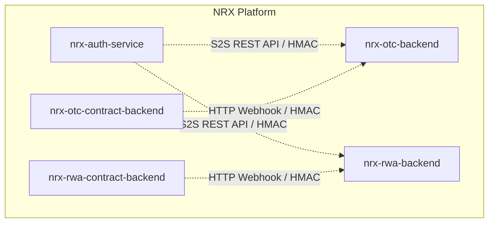
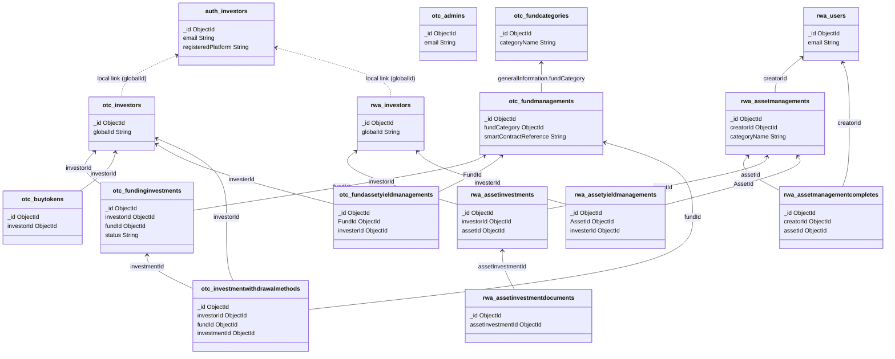

# Database Schema Documentation: NRX Platform

This document provides a comprehensive technical guide to the database schemas, collections, fields, indexes, constraints, relationships, and API operations across the services of the NRX platform.

---

## Architecture Overview

The NRX platform uses a microservices architecture with a shared authentication layer, dividing domain models across separate databases to ensure service boundaries:



1. **`nrx-auth-service`**: Acts as the central identity provider. It owns credentials, 2FA configurations, and core registration metadata.
2. **`nrx-otc-backend`**: Manages funds (OTC products), investments, local investor metadata, airdrops, and yields.
3. **`nrx-rwa-backend`**: Manages real-world tokenized assets (divided into Art, Mine, Agro, Ai, Realty, Energy), asset owners (Creators/Users), investments, and asset-specific yields.
4. **`nrx-otc-contract-backend` / `nrx-rwa-contract-backend`**: Stateless services listening to on-chain smart contract events. They do not own a database but query block checkpoints from the main backends and forward block events.

---

## 1. `nrx-auth-service` Collections

### Collection: `investors`
* **Purpose**: Centralized storage of credentials, phone/country codes, verification settings (KYC and Admin), and 2FA parameters.
* **Owner Service**: `nrx-auth-service`
* **Shared**: Yes (accessed by OTC and RWA backends via secure S2S API calls).

#### Schema Fields
| Field | Type | Required | Default | Indexed | Reference | Description |
|---|---|---|---|---|---|---|
| `_id` | ObjectId | Yes | Auto | Yes | - | Document Primary Key |
| `userName` | String | Yes | - | - | - | User handle chosen during registration |
| `profileImage` | String | No | - | - | - | S3 profile image link |
| `walletAddress` | String | No | - | - | - | Web3 wallet public address |
| `email` | String | Yes | - | Unique | - | Unique login email identifier |
| `password` | String | Yes | - | - | - | Bcrypt hashed login password |
| `status` | Number | Yes | `1` | - | - | Account status (e.g., 1 = active, 0 = inactive) |
| `countryCode` | Number | Yes | `159` | - | - | Country calling code (defaults to 159) |
| `twoFaEnabled` | Boolean | Yes | `false` | - | - | Flag enabling 2FA checks during login |
| `twoFaSecret` | String | No | `null` | - | - | Secret key used for TOTP code generation |
| `twoFaVerified` | Boolean | Yes | `false` | - | - | Verification status of active 2FA secret |
| `twoFaRecoveryCodes` | Array [String] | Yes | `[]` | - | - | Backup codes to bypass 2FA recovery |
| `reGeneratedTwoFaSecret` | String | No | `null` | - | - | Temporary secret during 2FA reset setup |
| `resetPasswordToken` | String | No | `null` | - | - | Unique token sent for password resets |
| `resetPasswordExpires` | Date | No | `null` | - | - | Expiration timestamp of reset token |
| `KYCVerified` | Number | Yes | `0` | - | - | KYC verification state (0 = pending, 1 = verified, 2 = rejected) |
| `AdminVerified` | Number | Yes | `0` | - | - | Admin override verification status |
| `phoneNumber` | Number | No | - | - | - | Contact phone number |
| `isCrypto` | Boolean | Yes | `false` | - | - | True if wallet connected; false for Web2 logins |
| `walletId` | String | No | - | - | - | Fireblocks vault wallet ID (Web2 users only) |
| `jwtToken` | String | No | - | - | - | Active session JSON Web Token |
| `registeredPlatform` | String | Yes | - | - | - | Platform origin: `"NRX-RWA"` or `"NRX-OTC"` |
| `createdAt` | Date | Yes | Auto | - | - | Auto-generated record creation timestamp |
| `updatedAt` | Date | Yes | Auto | - | - | Auto-generated record update timestamp |

---

## 2. `nrx-otc-backend` Collections

### Collection: `admins`
* **Purpose**: Credentials, sessions, and system permission mappings for administrators.
* **Owner Service**: `nrx-otc-backend`
* **Shared**: No (internal administrative usage).

#### Schema Fields
| Field | Type | Required | Default | Indexed | Reference | Description |
|---|---|---|---|---|---|---|
| `_id` | ObjectId | Yes | Auto | Yes | - | Document Primary Key |
| `walletAddress` | String | No | - | - | - | Admin Web3 wallet public address (force upper/lower normalization) |
| `email` | String | Yes | - | Unique | - | Unique login email identifier |
| `password` | String | Yes | - | - | - | Bcrypt hashed login password |
| `status` | Number | Yes | `1` | - | - | Account status (1 = active) |
| `jwtToken` | String | No | - | - | - | Deprecated/Legacy JWT token cache |
| `jwtTokens` | Array [String] | Yes | `[]` | - | - | Array of active administrative JWT sessions |
| `twoFactorEnabled` | Boolean | Yes | `false` | - | - | Flag indicating if 2FA is active |
| `twoFactorSecret` | String | No | `null` | - | - | Active TOTP secret key |
| `pendingTwoFactorSecret` | String | No | `null` | - | - | Unconfirmed TOTP secret key during setup |
| `twoFactorRecoveryCodeHash` | String | No | `null` | - | - | Bcrypt hash of the 2FA recovery backup code |
| `walletNonce` | String | No | `null` | - | - | Nonce used for Web3 cryptographic login |
| `walletNonceExpiresAt` | Date | No | `null` | - | - | Expiration timestamp of login nonce |
| `superAdmin` | Boolean | Yes | `true` | - | - | Bypasses all permissions checks when `true` |
| `permissions` | Array [String] | Yes | `[]` | - | - | Roles assigned to non-super admins |
| `createdAt` | Date | Yes | Auto | - | - | Record creation timestamp |
| `updatedAt` | Date | Yes | Auto | - | - | Record update timestamp |

---

### Collection: `investors`
* **Purpose**: Local representation of an investor profile inside the OTC system, holding platform email configurations and Fireblocks nonces.
* **Owner Service**: `nrx-otc-backend`
* **Shared**: No (mirrors auth-service record and binds local configurations).

#### Schema Fields
| Field | Type | Required | Default | Indexed | Reference | Description |
|---|---|---|---|---|---|---|
| `_id` | ObjectId | Yes | Auto | Yes | - | Local Primary Key |
| `globalId` | String | Yes | - | Yes | `nrx-auth-service.investors._id` | Links to central authentication profile |
| `walletAddress` | String | No | - | - | - | Public wallet address |
| `walletId` | String | No | - | - | - | Fireblocks vault wallet ID (Web2) |
| `walletNonce` | String | No | `null` | - | - | Cryptographic login nonce for signature verification |
| `walletNonceExpiresAt` | Date | No | `null` | - | - | Login nonce expiration |
| `isCrypto` | Boolean | Yes | `false` | - | - | True if wallet connected; false for Web2 logins |
| `status` | Number | Yes | `1` | - | - | Status indicator (1 = active) |
| `jwtToken` | String | No | - | - | - | Cache of active token |
| `refreshToken` | String | No | `null` | - | - | Cache of session refresh token |
| `accessTokenIssuedAt` | Date | No | `null` | - | - | Access token issue time |
| `deletedAt` | Date | No | `null` | - | - | Timestamp for soft deletion |
| `isAnonymized` | Boolean | Yes | `false` | - | - | Indicates if data was randomized/anonymized |
| `isNewFundAndInvestmentEmail` | Boolean | Yes | `true` | - | - | Pref: notifications for new funds or 70%+ fundings |
| `isInvestmentUpdateEmail` | Boolean | Yes | `true` | - | - | Pref: updates regarding ongoing investments |
| `isAssetYieldManagementEmail` | Boolean | Yes | `true` | - | - | Pref: notifications on processed yields/dividends |
| `createdAt` | Date | Yes | Auto | - | - | Record creation timestamp |
| `updatedAt` | Date | Yes | Auto | - | - | Record update timestamp |

---

### Collection: `investorcontactsupports`
* **Purpose**: Tracks contact support queries submitted by OTC investors.
* **Owner Service**: `nrx-otc-backend`
* **Shared**: No.

#### Schema Fields
| Field | Type | Required | Default | Indexed | Reference | Description |
|---|---|---|---|---|---|---|
| `_id` | ObjectId | Yes | Auto | Yes | - | Document Primary Key |
| `investorId` | ObjectId | No | - | - | `investors` | Linked local investor |
| `name` | String | Yes | - | - | - | Submitter name |
| `companyName` | String | No | - | - | - | Submitter corporate entity |
| `position` | String | No | - | - | - | Submitter title/position |
| `email` | String | Yes | - | - | - | Contact email |
| `phoneNumber` | String | Yes | - | - | - | Contact phone |
| `countryOfResidence` | String | Yes | - | - | - | Resident country |
| `preferredContact` | String | No | - | - | - | Method: email, phone, WhatsApp |
| `typeOfEnquiry` | String | Yes | - | - | - | Support category |
| `subject` | String | Yes | - | - | - | Query subject line |
| `message` | String | Yes | - | - | - | Context text |
| `isExisting` | Boolean | Yes | - | - | - | True if active investor |
| `preferredMethodOfResponse`| String | Yes | - | - | - | Response preference |
| `availabilityForContact` | String | No | - | - | - | Time slot availability |
| `documentUrl` | String | No | - | - | - | Attached document S3 URL |
| `status` | Number | No | - | - | - | Enquiry status: 0 = Open, 1 = In Progress, 2 = Closed |
| `createdAt` | Date | Yes | Auto | - | - | Query creation timestamp |
| `updatedAt` | Date | Yes | Auto | - | - | Query update timestamp |

---

### Collection: `investordeleteds`
* **Purpose**: Archival records of soft-deleted investor profiles.
* **Owner Service**: `nrx-otc-backend`
* **Shared**: No.

#### Schema Fields
| Field | Type | Required | Default | Indexed | Reference | Description |
|---|---|---|---|---|---|---|
| `_id` | ObjectId | Yes | Auto | Yes | - | Primary Key |
| `investorId` | ObjectId | Yes | - | - | `investors` | References original investor record |
| `globalId` | String | Yes | - | - | `nrx-auth-service.investors._id` | Central auth reference |
| `userName` | String | Yes | - | - | - | Username archive |
| `email` | String | Yes | - | Unique | - | Email archive |
| `walletAddress` | String | No | - | - | - | Wallet address archive |
| `walletId` | String | No | - | - | - | Fireblocks ID archive |
| `isCrypto` | Boolean | Yes | `false` | - | - | Crypto status archive |
| `status` | Number | Yes | `1` | - | - | Status archive |
| `jwtToken` | String | No | - | - | - | Token archive |
| `isNewFundAndInvestmentEmail` | Boolean | Yes | `true` | - | - | Preference state |
| `isInvestmentUpdateEmail` | Boolean | Yes | `true` | - | - | Preference state |
| `isAssetYieldManagementEmail` | Boolean | Yes | `true` | - | - | Preference state |
| `deletedAt` | Date | No | `null` | - | - | Deletion timestamp |
| `isAnonymized` | Boolean | Yes | `false` | - | - | Anonymized state |
| `createdAt` | Date | Yes | Auto | - | - | Record creation timestamp |
| `updatedAt` | Date | Yes | Auto | - | - | Record update timestamp |

---

### Collection: `airdrops`
* **Purpose**: Configured list of pending promotional or compliance airdrops.
* **Owner Service**: `nrx-otc-backend`
* **Shared**: No.

#### Schema Fields
| Field | Type | Required | Default | Indexed | Reference | Description |
|---|---|---|---|---|---|---|
| `_id` | ObjectId | Yes | Auto | Yes | - | Primary Key |
| `investorId` | ObjectId | Yes | - | - | `investors` | Recipient local investor ID |
| `walletAddress` | String | Yes | - | Unique | - | Target wallet address for airdrop |
| `amount` | Number | Yes | - | - | - | Quantity of tokens to airdrop |
| `createdAt` | Date | Yes | Auto | - | - | Creation timestamp |
| `updatedAt` | Date | Yes | Auto | - | - | Update timestamp |

---

### Collection: `successairdrops`
* **Purpose**: Audit ledger of executed airdrop transactions on the blockchain.
* **Owner Service**: `nrx-otc-backend`
* **Shared**: No.

#### Schema Fields
| Field | Type | Required | Default | Indexed | Reference | Description |
|---|---|---|---|---|---|---|
| `_id` | ObjectId | Yes | Auto | Yes | - | Primary Key |
| `investorId` | ObjectId | Yes | - | - | `investors` | Recipient local investor ID |
| `walletAddress` | String | Yes | - | - | - | Target wallet address |
| `amount` | Number | Yes | - | - | - | Amount of tokens delivered |
| `transactionHash` | String | Yes | - | - | - | Blockchain tx hash |
| `transactionDate` | Date | Yes | `Date.now` | - | - | Date of on-chain confirmation |
| `createdAt` | Date | Yes | Auto | - | - | Record creation timestamp |
| `updatedAt` | Date | Yes | Auto | - | - | Record update timestamp |

---

### Collection: `fundcategories`
* **Purpose**: Groups and classifies different funds (e.g. dynamic yield, private equity).
* **Owner Service**: `nrx-otc-backend`
* **Shared**: No.

#### Schema Fields
| Field | Type | Required | Default | Indexed | Reference | Description |
|---|---|---|---|---|---|---|
| `_id` | ObjectId | Yes | Auto | Yes | - | Primary Key |
| `categoryName` | String | Yes | - | Unique | - | Name of category |
| `description` | String | No | - | - | - | Classification summary |
| `fileUrl` | String | Yes | - | - | - | Banner icon S3 link |
| `createdAt` | Date | Yes | Auto | - | - | Creation timestamp |
| `updatedAt` | Date | Yes | Auto | - | - | Update timestamp |

---

### Collection: `fundmanagements`
* **Purpose**: Master table of all OTC financial funds, tracking volumes, structures, fees, contracts, and progress.
* **Owner Service**: `nrx-otc-backend`
* **Shared**: No.

#### Schema Fields
| Field | Type | Required | Default | Indexed | Reference | Description |
|---|---|---|---|---|---|---|
| `_id` | ObjectId | Yes | Auto | Yes | - | Primary Key |
| `generalInformation` | Object | Yes | - | - | - | Nested general details (see below) |
| `investmentStructure` | Object | Yes | - | - | - | Nested structural details (see below) |
| `feesAndCosts` | Object | Yes | - | - | - | Nested fee definitions (see below) |
| `fundStrategyAndObjectives` | Object | Yes | - | - | - | Nested focus/risk details (see below) |
| `complianceAndGovernance` | Object | Yes | - | - | - | Nested legal/governing rules (see below) |
| `digitalMediaAndPresentation` | Object | Yes | - | - | - | Nested logo/banners/factsheets (see below) |
| `fundId` | Number | No | - | Unique, Sparse| - | Auto-incremented platform numerical ID |
| `smartContractReference` | String | Yes | - | Unique | - | Smart contract address managing the fund on-chain |
| `fundedPercentage` | Number | Yes | `0` | - | - | Current funding progress ratio |
| `totalInvestedAmount` | Number | Yes | `0` | - | - | Total cash invested |
| `fundStatus` | String | Yes | `"On Going"` | - | - | Status flag (`"On Going"`, `"Closing Soon"`, `"Closed"`) |
| `remainingFundVolume` | Number | No | - | - | - | Free allocation left |
| `createdAt` | Date | Yes | Auto | - | - | Record creation timestamp |
| `updatedAt` | Date | Yes | Auto | - | - | Record update timestamp |

#### Nested Subdocuments

##### 1. `generalInformation`
* `fundName` (String): Display name.
* `fundCategory` (ObjectId, ref: `FundCategory`): Links classification.
* `subcategory` (String, Optional): Sub-classification.
* `description` (String): Fund summary.
* `operatingEntity` (String, Optional): Issuing corporate name.
* `fundLaunchDate` (String, Optional): Launch Date (YYYY-MM-DD).
* `fundCurrency` (String): Base currency (e.g. EUR, USD).

##### 2. `investmentStructure`
* `minimumInvestment` (Number): Min entry ticket.
* `maximumInvestment` (Number, Optional): Max entry ticket.
* `totalFundVolume` (Number): Capital target size.
* `subscriptionType` (String): Type (e.g. tokens, shares).
* `maturityPeriod` (String): Duration.
* `dividendDistributionFrequency` (String): Distribution interval.
* `yieldType` (String): Variable or Fixed.
* `expectedAnnualisedReturn` (String): Target return.
* `capitalProtectionLevel` (String): Protection level.
* `redemptionPolicy` (String): Exit options.

##### 3. `feesAndCosts`
* `subscriptionFee` (Number), `managementFee` (Number), `performanceFee` (Number, Optional), `administrativeCustodyFee` (Number), `exitFee` (Number, Optional), `auditLegalFeeAllocation` (Number, Optional).

##### 4. `fundStrategyAndObjectives`
* `investmentFocus` (String), `geographicalExposure` (String), `riskLevel` (String), `expectedVolatility` (String), `benchmarkReferenceIndex` (String, Optional), `useOfLeverage` (Boolean), `maximum` (Number, Optional), `liquidityManagementStrategy` (String), `insuranceCoverage` (String, Optional).

##### 5. `complianceAndGovernance`
* `regulatoryJurisdiction` (String), `investorEligibility` (String), `auditor` (String, Optional), `reportingFrequency` (String), `disputeResolutionVenue` (String), `governingLaw` (String).

##### 6. `digitalMediaAndPresentation`
* `fundLogo` (String, Optional), `promotionalBanner` (String, Optional), `fundVideoPresentation` (String, Optional), `pdfSummaryFactsheet` (String, Optional), `whitepaperLink` (String, Optional), `investorPresentationDeck` (String, Optional).

---

### Collection: `fundinginvestments`
* **Purpose**: Tracks investments placed into funds by local OTC investors.
* **Owner Service**: `nrx-otc-backend`
* **Shared**: No.

#### Schema Fields
| Field | Type | Required | Default | Indexed | Reference | Description |
|---|---|---|---|---|---|---|
| `_id` | ObjectId | Yes | Auto | Yes | - | Primary Key |
| `investorId` | ObjectId | Yes | - | - | `investors` | Placing investor |
| `fundId` | ObjectId | Yes | - | - | `fundmanagements` | Targeted fund |
| `totalAmount` | Number | Yes | - | - | - | Investment sum (including fee) |
| `investedAmount` | Number | Yes | - | - | - | Net investment sum |
| `subscriptionFee` | Number | Yes | - | - | - | Calculated entry fee charged |
| `investId` | Number | No | - | - | - | Smart contract internal investment index ID |
| `transactionHash` | String | No | - | - | - | Deposit transaction hash |
| `status` | String | Yes | `"pending"` | - | - | State: `"pending"`, `"approved"`, `"rejected"`, `"completed"` |
| `documentUrl` | String | No | - | - | - | Signed investment agreement PDF URL |
| `documentType` | String | Yes | `"investment-agreement"` | - | - | Document categorization |
| `rejectedReason` | String | No | - | - | - | Administrative rejection reason |
| `nextYieldClaimTime` | Array [Number] | Yes | `[]` | - | - | Epoch timestamps for yield distribution gates |
| `maturityTime` | Number | No | - | - | - | Epoch timestamp of investment maturity |
| `isClaimed` | Boolean | Yes | `false` | - | - | Flag indicating if principal/yield is fully claimed |
| `withdrawalStatus` | String | Yes | `"pending"` | - | - | State: `"pending"`, `"requested"`, `"approved"`, `"rejected"` |
| `withdrawalRejectedReason` | String | No | - | - | - | Reason for withdrawal rejection |
| `withdrawalTransactionHash`| String | No | - | - | - | Exit payout transaction hash |
| `withdrawalAmount` | Number | No | - | - | - | Gross amount approved for withdrawal |
| `withdrawalExitFeeDeducted` | Number | No | - | - | - | Exit fee amount deducted |
| `withdrawalTime` | Number | No | - | - | - | Timestamp of withdrawal execution |
| `maturityEmailSent` | Boolean | Yes | `false` | - | - | Track email status on maturity |
| `unclaimedYieldAmount` | Number | No | - | - | - | Remaining undistributed yields |
| `withdrawalTotalAmount` | Number | No | - | - | - | Net payout amount sent |
| `recipient` | String | No | - | - | - | Target wallet payout address |
| `ownershipPercentage` | Number | Yes | `0` | - | - | Share weight of current fund volume |
| `pastOwnershipPercentage` | Number | Yes | `0` | - | - | Saved weight prior to changes |
| `createdAt` | Date | Yes | Auto | - | - | Record creation timestamp |
| `updatedAt` | Date | Yes | Auto | - | - | Record update timestamp |

---

### Collection: `fundassetyieldmanagements`
* **Purpose**: Calculated yields and payouts allocated to investors per period.
* **Owner Service**: `nrx-otc-backend`
* **Shared**: No.

#### Schema Fields
| Field | Type | Required | Default | Indexed | Reference | Description |
|---|---|---|---|---|---|---|
| `_id` | ObjectId | Yes | Auto | Yes | - | Primary Key |
| `FundId` | ObjectId | No | - | Yes | `fundmanagements` | Source fund |
| `investerId` | ObjectId | Yes | - | Yes | `investors` | Target investor |
| `investmentId` | Number | No | - | Yes | - | Linked internal numeric investment index |
| `netAmount` | Number | Yes | - | - | - | Calculated payout value |
| `sharesHolding` | Number | Yes | - | - | - | Shares owned at generation time |
| `yieldMonth` | Number | Yes | - | Yes | - | Distribution period month |
| `yieldDay` | Number | Yes | - | - | - | Distribution period day |
| `yieldYear` | Number | Yes | - | Yes | - | Distribution period year |
| `yieldType` | String | Yes | - | Yes | - | Category: `"fund"` (yield generated) or `"withdraw"` |
| `status` | String | Yes | `"Pending"` | - | - | State: `"Pending"`, `"Completed"`, `"Failed"` |
| `transactionHash` | String | No | `null` | - | - | Distribution payout tx hash |
| `isYieldClosed` | Boolean | Yes | `false` | - | - | If true, period is locked |
| `isWithdrawn` | Boolean | Yes | `false` | - | - | If true, yield is withdrawn |
| `isClaimProcessedAt` | Number | No | - | - | - | Timestamp of claim processing |
| `createdAt` | Date | Yes | Auto | - | - | Creation timestamp |
| `updatedAt` | Date | Yes | Auto | - | - | Update timestamp |

#### Compound Indexes
* **Unique Yield Constraints**:
  ```javascript
  { FundId: 1, investerId: 1, investmentId: 1, yieldMonth: 1, yieldYear: 1, yieldType: 1 }
  ```
  * *Constraint*: Unique index, partial filter expression: `{ yieldType: "fund" }` (allows multiple withdrawals, but only one yield issue per period).

---

### Collection: `buytokens`
* **Purpose**: Direct purchases of NRX utilities/stable tokens via card or USDC.
* **Owner Service**: `nrx-otc-backend`
* **Shared**: No.

#### Schema Fields
| Field | Type | Required | Default | Indexed | Reference | Description |
|---|---|---|---|---|---|---|
| `_id` | ObjectId | Yes | Auto | Yes | - | Primary Key |
| `investorId` | ObjectId | Yes | - | - | `investors` | Purchasing investor |
| `amount` | Number | Yes | - | - | - | Fiat/stable value paid |
| `nrxToken` | Number | Yes | - | - | - | Received NRX token amount |
| `type` | String | Yes | - | - | - | Currency: `"usdc"` or `"euro"` |
| `status` | Number | Yes | `0` | - | - | State: 0 = Pending/Initiated, 1 = Success |
| `receiptUrl` | String | No | - | - | - | S3 payment receipt image URL |
| `orderId` | String | No | - | Unique, Sparse| - | Unique check/gateway order identifier |
| `transactionHash` | String | No | - | - | - | Stablecoin payout tx hash |
| `createdAt` | Date | Yes | Auto | - | - | Creation timestamp |
| `updatedAt` | Date | Yes | Auto | - | - | Update timestamp |

---

### Collection: `listenerblockcheckpoints`
* **Purpose**: Captures the block pointer where the smart contract listener was last active.
* **Owner Service**: `nrx-otc-backend`
* **Shared**: Yes (read by `nrx-otc-contract-backend` to resume events).

#### Schema Fields
| Field | Type | Required | Default | Indexed | Reference | Description |
|---|---|---|---|---|---|---|
| `_id` | String | Yes | `"global"` | Yes | - | Singleton Primary Key |
| `blockNumber` | Number | Yes | - | - | - | Highest block parsed |
| `createdAt` | Date | Yes | Auto | - | - | Creation timestamp |
| `updatedAt` | Date | Yes | Auto | - | - | Update timestamp |

---

### Collection: `investmentwithdrawalmethods`
* **Purpose**: Encrypted banking coordinates for OTC cash out requests.
* **Owner Service**: `nrx-otc-backend`
* **Shared**: No.

#### Schema Fields
| Field | Type | Required | Default | Indexed | Reference | Description |
|---|---|---|---|---|---|---|
| `_id` | ObjectId | Yes | Auto | Yes | - | Primary Key |
| `investorId` | ObjectId | Yes | - | - | `investors` | Linked investor |
| `fundId` | ObjectId | Yes | - | - | `fundmanagements` | Linked fund |
| `investmentId` | ObjectId | Yes | - | - | `fundinginvestments` | Linked investment |
| `withdrawalMethod` | String | Yes | - | - | - | Method: `"nrx token"`, `"usdc"`, `"euro"` |
| `walletAddress` | String | No | - | - | - | Public wallet target |
| `region` | String | No | - | - | - | Bank region |
| `country` | String | No | - | - | - | Bank country |
| `iban` | String (Encrypted) | No | - | - | - | Encrypted IBAN number |
| `swift` | String (Encrypted) | No | - | - | - | Encrypted SWIFT/BIC |
| `sortCode` | String (Encrypted) | No | - | - | - | Encrypted Sort Code |
| `bankCode` | String (Encrypted) | No | - | - | - | Encrypted Bank Code |
| `branchCode` | String (Encrypted) | No | - | - | - | Encrypted Branch Code |
| `sepa` | Boolean | No | - | - | - | SEPA transfer capability flag |
| `accountNumber` | String (Encrypted) | No | - | - | - | Encrypted Account Number |
| `routingNumber` | String (Encrypted) | No | - | - | - | Encrypted Routing Number |
| `fedwireCode` | String (Encrypted) | No | - | - | - | Encrypted Fedwire |
| `transitNumber` | String (Encrypted) | No | - | - | - | Encrypted Transit Code |
| `pixKey` | String (Encrypted) | No | - | - | - | Encrypted Pix Key |
| `clabe` | String (Encrypted) | No | - | - | - | Encrypted CLABE number |
| `cbu` | String (Encrypted) | No | - | - | - | Encrypted CBU number |
| `cbu` | String (Encrypted) | No | - | - | - | Encrypted CBU number |
| `cci` | String (Encrypted) | No | - | - | - | Encrypted CCI number |
| `ifscCode` | String (Encrypted) | No | - | - | - | Encrypted IFSC code |
| `upiId` | String (Encrypted) | No | - | - | - | Encrypted UPI ID |
| `cnapsCode` | String (Encrypted) | No | - | - | - | Encrypted CNAPS code |
| `bankClearingCode` | String (Encrypted) | No | - | - | - | Encrypted Bank Clearing Code |
| `branchClearingCode`| String (Encrypted) | No | - | - | - | Encrypted Branch Clearing Code |
| `bsbCode` | String (Encrypted) | No | - | - | - | Encrypted BSB Code |
| `brstnCode` | String (Encrypted) | No | - | - | - | Encrypted BRSTN Code |
| `zenginCode` | String (Encrypted) | No | - | - | - | Encrypted Zengin Code |
| `nccCode` | String (Encrypted) | No | - | - | - | Encrypted NCC Code |
| `bankName` | String (Encrypted) | No | - | - | - | Encrypted bank institution name |
| `bankCountry` | String | No | - | - | - | Bank country location |
| `accountHolderName`| String (Encrypted) | No | - | - | - | Encrypted owner name |
| `accountHolderType`| String | No | - | - | - | Type (e.g. Individual, Business) |
| `countryOfResidence`| String | No | - | - | - | Holder residence country |
| `countryOfBank` | String | No | - | - | - | Location country of bank |
| `currency` | String | No | - | - | - | Base payout currency |
| `accountType` | String | No | - | - | - | Checking, Savings |
| `bankAddress1` | String (Encrypted) | No | - | - | - | Encrypted bank address lines |
| `bankAddress2` | String (Encrypted) | No | - | - | - | Encrypted bank address lines |
| `city` | String (Encrypted) | No | - | - | - | Encrypted bank city |
| `zipCode` | String (Encrypted) | No | - | - | - | Encrypted bank zip code |
| `state` | String (Encrypted) | No | - | - | - | Encrypted bank state |
| `bankContact` | String (Encrypted) | No | - | - | - | Encrypted bank contact details |
| `createdAt` | Date | Yes | Auto | - | - | Creation timestamp |
| `updatedAt` | Date | Yes | Auto | - | - | Update timestamp |

---

### Collection: `site_settings`
* **Purpose**: Global frontend styling variables and admin 2FA control.
* **Owner Service**: `nrx-otc-backend`
* **Shared**: No.

#### Schema Fields
| Field | Type | Required | Default | Indexed | Reference | Description |
|---|---|---|---|---|---|---|
| `_id` | ObjectId | Yes | Auto | Yes | - | Primary Key |
| `key` | String | Yes | `"global"` | Unique | - | Single settings row lock key |
| `platformName` | String | No | - | - | - | Label for browser tabs/headers |
| `platformLogo` | String | No | - | - | - | S3 URL main logo |
| `platformFavicon` | String | No | - | - | - | S3 URL favicon |
| `platformHeaderLogo`| String | No | - | - | - | S3 URL alternate header logo |
| `adminTwoFactorEnabled`| Boolean| Yes | `false` | - | - | Enforces 2FA verification across admins |
| `createdAt` | Date | Yes | Auto | - | - | Creation timestamp |
| `updatedAt` | Date | Yes | Auto | - | - | Update timestamp |

---

## 3. `nrx-otc-contract-backend`
This service operates as a **stateless, database-free microservice**.
* **Role**: Websocket-based smart contract event listener.
* **Persistence**: Reads block numbers and registers updates against `nrx-otc-backend`'s API path `/api/v1/listeners/block-checkpoint` using signed S2S payloads. It keeps no local database or memory maps that survive restarts.

---

## 4. `nrx-rwa-backend` Collections

### Collection: `admins`
* **Purpose**: Credentials and 2FA states for RWA platform administrators.
* **Owner Service**: `nrx-rwa-backend`
* **Shared**: No.

#### Schema Fields
| Field | Type | Required | Default | Indexed | Reference | Description |
|---|---|---|---|---|---|---|
| `_id` | ObjectId | Yes | Auto | Yes | - | Primary Key |
| `name` | String | No | - | - | - | Admin display name |
| `walletAddress` | String | No | - | - | - | Wallet address for Web3 admin login |
| `email` | String | Yes | - | Unique | - | Login email ID |
| `password` | String | Yes | - | - | - | Bcrypt hashed password |
| `status` | Number | Yes | `1` | - | - | Status (1 = active) |
| `jwtToken` | String | No | - | - | - | Token cache |
| `jwtTokens` | Array [String] | Yes | `[]` | - | - | Active admin sessions |
| `twoFactorEnabled` | Boolean | Yes | `false` | - | - | Active 2FA status |
| `twoFactorSecret` | String | No | `null` | - | - | Secret TOTP key |
| `pendingTwoFactorSecret` | String | No | `null` | - | - | Pending TOTP secret |
| `twoFactorRecoveryCodeHash` | String | No | `null` | - | - | Recovery hash |
| `walletNonce` | String | No | `null` | - | - | Sign nonce |
| `walletNonceExpiresAt` | Date | No | `null` | - | - | Nonce expiry |
| `superAdmin` | Boolean | Yes | `true` | - | - | Overrides all restrictions when true |
| `permissions` | Array [String] | Yes | `[]` | - | - | Sub-permissions |
| `createdAt` | Date | Yes | Auto | - | - | Creation timestamp |
| `updatedAt` | Date | Yes | Auto | - | - | Update timestamp |

---

### Collection: `users`
* **Purpose**: Profile and credential registry for Real World Asset (RWA) Creators / Asset Owners.
* **Owner Service**: `nrx-rwa-backend`
* **Shared**: No.

#### Schema Fields
| Field | Type | Required | Default | Indexed | Reference | Description |
|---|---|---|---|---|---|---|
| `_id` | ObjectId | Yes | Auto | Yes | - | Primary Key |
| `userName` | String | Yes | - | - | - | Chosen username |
| `profileImage` | String | No | - | - | - | S3 Image URL |
| `walletAddress` | String | No | - | - | - | Connected public wallet address |
| `email` | String | Yes | - | Unique | - | Creator registration email ID |
| `password` | String | Yes | - | - | - | Bcrypt hashed password |
| `status` | Number | Yes | `1` | - | - | Status (1 = active) |
| `jwtToken` | String | No | - | - | - | Active session token |
| `nonce` | Number | Yes | `0` | - | - | Cryptographic login validation nonce |
| `countryCode` | Number | Yes | `159` | - | - | Telephone country code |
| `twoFaEnabled` | Boolean | Yes | `false` | - | - | 2FA status flag |
| `twoFaSecret` | String | No | `null` | - | - | TOTP active secret |
| `reGeneratedTwoFaSecret` | String | No | `null` | - | - | Temporary setup secret |
| `twoFaVerified` | Boolean | Yes | `false` | - | - | Setup verification check |
| `twoFaRecoveryCodes` | String | No | `null` | - | - | Serialized 2FA backup codes |
| `resetPasswordToken` | String | No | `null` | - | - | Expiry reset token |
| `resetPasswordExpires` | Date | No | `null` | - | - | Expiry timestamp |
| `KYCVerified` | Number | Yes | `0` | - | - | KYC state (0 = pending, 1 = verified, 2 = rejected) |
| `AdminVerified` | Number | Yes | `0` | - | - | Admin override verification status |
| `phoneNumber` | Number | No | - | - | - | Phone number |
| `isCrypto` | Boolean | Yes | `false` | - | - | True for Web3 registrations, false for Web2 (Fireblocks) |
| `walletId` | String | No | - | - | - | Fireblocks vault wallet ID (Web2) |
| `walletNonce` | String | No | `null` | - | - | Login signing nonce |
| `walletNonceExpiresAt` | Date | No | `null` | - | - | Login nonce expiration |
| `isAssetConfirmations` | Boolean | Yes | `true` | - | - | Email preference: asset processing state updates |
| `isInvestmentConfirmations`| Boolean | Yes | `true` | - | - | Email preference: asset mutual agreements and buy-backs |
| `deletedAt` | Date | No | `null` | - | - | Soft-delete timestamp |
| `isAnonymized` | Boolean | Yes | `false` | - | - | Randomization tracking flag |
| `assetOwnerAgreementUrl` | String | No | `null` | - | - | S3 URL to signed platform asset agreement |
| `createdAt` | Date | Yes | Auto | - | - | Creation timestamp |
| `updatedAt` | Date | Yes | Auto | - | - | Update timestamp |

---

### Collection: `userdeleteds`
* **Purpose**: Archival records of soft-deleted RWA Creator accounts.
* **Owner Service**: `nrx-rwa-backend`
* **Shared**: No.

#### Schema Fields
* **Mirroring Schema**: Inherits all fields defined in the `users` schema, referencing the source record via `userId` (ObjectId, ref: `User`, Required).

---

### Collection: `usercontactsupports`
* **Purpose**: Contact support tickets submitted by RWA Creators/Asset Owners.
* **Owner Service**: `nrx-rwa-backend`
* **Shared**: No.

#### Schema Fields
* **Mirroring Schema**: Inherits all fields of the support schema (like `name`, `email`, `subject`, `message`), referencing the Creator via `userId` (ObjectId, ref: `User`, Required).

---

### Collection: `investors`
* **Purpose**: Local representation of an investor profile inside RWA, defining preferences and wallet keys.
* **Owner Service**: `nrx-rwa-backend`
* **Shared**: No (binds RWA platform configuration options).

#### Schema Fields
| Field | Type | Required | Default | Indexed | Reference | Description |
|---|---|---|---|---|---|---|
| `_id` | ObjectId | Yes | Auto | Yes | - | Local Primary Key |
| `globalId` | String | Yes | - | Yes | `nrx-auth-service.investors._id` | Central auth reference |
| `walletAddress` | String | No | - | - | - | Public wallet address |
| `walletId` | String | No | - | - | - | Fireblocks ID (Web2) |
| `walletNonce` | String | No | `null` | - | - | Login signing nonce |
| `walletNonceExpiresAt` | Date | No | `null` | - | - | Login nonce expiration |
| `isCrypto` | Boolean | Yes | `false` | - | - | True for Web3, false for Web2 (Fireblocks) |
| `status` | Number | Yes | `1` | - | - | Status (1 = active) |
| `jwtToken` | String | No | - | - | - | Token cache |
| `refreshToken` | String | No | `null` | - | - | Refresh token cache |
| `accessTokenIssuedAt` | Date | No | `null` | - | - | Issuance timestamp |
| `isNewAssetAndInvestmentEmail` | Boolean | Yes | `true` | - | - | Email preference: new assets or 70%+ funding |
| `isInvestmentUpdateEmail` | Boolean | Yes | `true` | - | - | Email preference: investment updates |
| `isAssetYieldManagementEmail` | Boolean | Yes | `true` | - | - | Email preference: yield notifications |
| `deletedAt` | Date | No | `null` | - | - | Soft-delete timestamp |
| `isAnonymized` | Boolean | Yes | `false` | - | - | Anonymization tracking flag |
| `createdAt` | Date | Yes | Auto | - | - | Record creation timestamp |
| `updatedAt` | Date | Yes | Auto | - | - | Record update timestamp |

---

### Collection: `investordeleteds`
* **Purpose**: Archival records of soft-deleted RWA investors.
* **Owner Service**: `nrx-rwa-backend`
* **Shared**: No.

#### Schema Fields
* **Mirroring Schema**: Inherits all fields of the local RWA `investors` schema, referencing the source record via `investorId` (ObjectId, ref: `Investor`, Required).

---

### Collection: `investorcontactsupports`
* **Purpose**: Contact support tickets submitted by RWA Investors.
* **Owner Service**: `nrx-rwa-backend`
* **Shared**: No.

#### Schema Fields
* **Mirroring Schema**: Inherits support fields, referencing the investor via `investorId` (ObjectId, ref: `Investor`, Required).

---

### Collection: `cronstates`
* **Purpose**: Distributed lock to prevent concurrent executions of cron tasks across server instances.
* **Owner Service**: `nrx-rwa-backend`
* **Shared**: No.

#### Schema Fields
| Field | Type | Required | Default | Indexed | Reference | Description |
|---|---|---|---|---|---|---|
| `_id` | ObjectId | Yes | Auto | Yes | - | Primary Key |
| `jobName` | String | Yes | - | Unique | - | Name identifier of the scheduled task |
| `isRunning` | Boolean | Yes | `false` | - | - | Lock status (true = active run) |
| `lockedAt` | Date | No | - | - | - | Lock start timestamp |
| `lockUntil` | Date | No | - | - | - | Lock expiration threshold |
| `lockToken` | String | No | - | - | - | Unique token string matching active instance |
| `lastProcessedId`| Mixed | No | - | - | - | Progress tracking offset cursor |
| `lastRun` | Date | No | - | - | - | Timestamp of last execution |
| `createdAt` | Date | Yes | Auto | - | - | Record creation timestamp |
| `updatedAt` | Date | Yes | Auto | - | - | Record update timestamp |

---

### Collection: `listenerblockcheckpoints`
* **Purpose**: Captures the block pointer where the smart contract listener was last active.
* **Owner Service**: `nrx-rwa-backend`
* **Shared**: Yes (read by `nrx-rwa-contract-backend` to resume events).

#### Schema Fields
| Field | Type | Required | Default | Indexed | Reference | Description |
|---|---|---|---|---|---|---|
| `_id` | String | Yes | `"global"` | Yes | - | Singleton Primary Key |
| `blockNumber` | Number | Yes | - | - | - | Highest block parsed |
| `createdAt` | Date | Yes | Auto | - | - | Creation timestamp |
| `updatedAt` | Date | Yes | Auto | - | - | Update timestamp |

---

### Collection: `adminsettings`
* **Purpose**: System pricing configurations and holding intervals for RWA listings.
* **Owner Service**: `nrx-rwa-backend`
* **Shared**: No.

#### Schema Fields
| Field | Type | Required | Default | Indexed | Reference | Description |
|---|---|---|---|---|---|---|
| `_id` | ObjectId | Yes | Auto | Yes | - | Primary Key |
| `holdingPeriod` | Number | No | - | - | - | Minimum investment holding period (in months) |
| `creationFee` | Number | No | - | - | - | Asset registration commission fee (%) |
| `transactionFee`| Number | No | - | - | - | Investor trading service charge (%) |
| `serviceChargePercent`| Number| No | - | - | - | Platform operations fee (%) |
| `createdAt` | Date | Yes | Auto | - | - | Creation timestamp |
| `updatedAt` | Date | Yes | Auto | - | - | Update timestamp |

---

### Collection: `dividendfundmanagements`
* **Purpose**: Tracks cumulative distributed dividend amounts.
* **Owner Service**: `nrx-rwa-backend`
* **Shared**: No.

#### Schema Fields
| Field | Type | Required | Default | Indexed | Reference | Description |
|---|---|---|---|---|---|---|
| `_id` | ObjectId | Yes | Auto | Yes | - | Primary Key |
| `dividendAmount` | Number | Yes | - | - | - | Total dividends distributed |
| `createdAt` | Date | Yes | Auto | - | - | Creation timestamp |
| `updatedAt` | Date | Yes | Auto | - | - | Update timestamp |

---

### Collection: `site_settings`
* **Purpose**: Appearance settings for the RWA platform.
* **Owner Service**: `nrx-rwa-backend`
* **Shared**: No.

#### Schema Fields
* **Mirroring Schema**: Identical fields and structure to the OTC `site_settings` collection.

---

### Collection: `assetmanagements`
* **Purpose**: Stores detailed asset parameters, classification category, and nested category metadata.
* **Owner Service**: `nrx-rwa-backend`
* **Shared**: No.

#### Schema Fields
| Field | Type | Required | Default | Indexed | Reference | Description |
|---|---|---|---|---|---|---|
| `_id` | ObjectId | Yes | Auto | Yes | - | Primary Key |
| `creatorId` | ObjectId | No | - | Yes | `users` | Binds asset to Creator/Owner |
| `AdminId` | ObjectId | No | - | - | `admins` | Processing admin |
| `categoryName` | String | Yes | - | Yes | - | Category (Art, Mine, Agro, Ai, Realty, Energy) |
| `assetManagementStatus`| Number | No | - | Yes | - | State: 0 = draft, 1 = complete, 2 = Approved, 3 = rejected |
| `progressBar` | Number | Yes | `0` | - | - | Funding progress percentage |
| `remainingTokens`| Number | No | `0` | - | - | Unsold token volume remaining |
| `holdingPeriod` | Number | No | - | - | - | Holding duration (copied from settings) |
| `propertyId` | String | No | - | - | - | System property identifier |
| `securityToken` | String | No | - | - | - | Security token address (generated on approval) |
| `isInvestmentClosed`| Boolean | Yes | `false` | - | - | Flag indicating if funding is closed |
| `investmentCloseDate`| Date | No | - | - | - | Expiration of funding round |
| `rejectedReason` | String | No | - | - | - | Administrative rejection details |
| `isAdminEdited` | Boolean | No | - | - | - | Flag indicating admin modifications |
| `transactionHash`| String | No | - | - | - | Smart contract deployment hash |
| `tokenName` | String | No | - | - | - | ERC20 token name |
| `tokenSymbol` | String | No | - | - | - | ERC20 token symbol |
| `assetStatus` | String | No | - | - | - | Platform status: `"On Going"`, `"Closing Soon"`, `"Closed"` |
| `assetCompletionStatus`| Number | No | - | - | - | Completion phase: 0 = requested, 1 = completed, 2 = rejected |
| `basicInformation`| Object | Yes | - | - | - | Nested parameters based on `categoryName` (see below) |
| `createdAt` | Date | Yes | Auto | - | - | Creation timestamp |
| `updatedAt` | Date | Yes | Auto | - | - | Update timestamp |

#### Compound Indexes
* `{ creatorId: 1, categoryName: 1 }`
* `{ assetManagementStatus: 1 }`

#### Nested Category Schemas (`basicInformation`)

##### 1. `Mine` (Mining projects)
* `basicProjectInformation`: `projectName`, `miningProjectType`, `assetSubtypes`, `address`, `location` (latitude/longitude), `projectStatus`, `ownershipType`, `licenceTypeNumber` (licenceTypeAndNumber, licenceFile).
* `geologicalTechnicalDetails`: `resourceEstimate` (resourceEstimate, file), `reserveClassification` (reserve_classification, file), `cutOffGrade`, `averageGrade`, `miningMethod`, `processingMethod`, `processingCapacity`, `stripRatio`, `metallurgicalRecoveryRate`, `mineLife`, `plantEquipmentDetails`, `tailingsStorageFacility` (tailingsStorageFacilityDestails, file).
* `complianceCertification`: Permits, environmental impact assessment, social agreements, health/safety certificates, closure plans, export permits.
* `financialTokenisationDetails`: Valuations, production, opex/capex, monthly yields, tokens/pricing, yieldType (Fixed/Variable), monthlyRentalYield, hedging contracts.

##### 2. `Ai` (AI Computing models/Infrastructure)
* `basicProjectInformation`: Project info, stacks, statuses.
* `technicalProductDetails`: Tech stack, size, latency, accuracy benchmarks, computing infrastructure provider, patents/IP.
* `complianceCertification`: Data protection certificates, ethics audits, cybersecurity certificates.
* `financialTokenisationDetails`: Valuations, revenues, token counts, pricing, monthly yields.

##### 3. `Art` (Artwork/Paintings/Sculptures)
* `basicProjectInformation`: Artist details, year, dimensions, location.
* `provenanceAuthenticity`: Provenance documentation, certificates, appraisal reports, condition reports.
* `custodyStorage`: Custodian agreement details, insurance policies, transportation logs.
* `financialTokenisationDetails`: Art valuation, opex, token details, pricing, commission fees.

##### 4. `Agro` (Agriculture/Farms/Livestock/Aquaculture)
* `basicProjectInformation`: Agricultural type, locations, details.
* `technicalProductionDetails`: Land area, irrigation, climate, species, dairy/livestock sizing, aquaculture biosecurity.
* `complianceCertification`: Water rights, land titles, safety certifications.
* `financialTokenisationDetails`: Valuations, carbon credit eligibility, token details.

##### 5. `Realty` (Real Estate/Commercial/Residential)
* `basicProjectInformation`: Real estate type, addresses.
* `technicalPropertyDetails`: grossFloorArea, leasableArea, occupancy rates, average leases, green rating.
* `complianceCertification`: Land titles zoning, zoning permits, fire safety certifications.
* `financialTokenisationDetails`: Valuations, net operating income, mortgage encumbrance details.

##### 6. `Energy` (Wind/Solar PV/Biofuels/Oil/Gas)
* `basicProjectInformation`: Energy type, permits.
* `technicalPropertyDetails`: Basin fields, capacity factors, solar PVSpecs, turbine hub heights, biofuel feedstock supplies.
* `complianceCertification`: Generation permits, safety regulations.
* `financialTokenisationDetails`: Valuations, production forecasts, revenue models.

---

### Collection: `assetmanagementcompletes`
* **Purpose**: Final details on completed assets (realty sales or project closures).
* **Owner Service**: `nrx-rwa-backend`
* **Shared**: No.

#### Schema Fields
| Field | Type | Required | Default | Indexed | Reference | Description |
|---|---|---|---|---|---|---|
| `_id` | ObjectId | Yes | Auto | Yes | - | Primary Key |
| `creatorId` | ObjectId | No | - | - | `users` | Original Creator |
| `AdminId` | ObjectId | No | - | - | `admins` | Verifying admin |
| `assetId` | ObjectId | Yes | - | - | `assetmanagements` | Completed asset |
| `assetCompletionDate`| Date | No | - | - | - | Date of completion |
| `assetFinalAmount` | Number | No | - | - | - | Final funding volume realized |
| `assetSummary` | String | No | - | - | - | Administrative completion report |
| `assetCompletionDocumentUrl`| Array [String]| Yes| `[]` | - | - | S3 links to completion documents |
| `assetCompletionRejectedReason`| String | No | - | - | - | Reason for rejection |
| `profitGenerated` | Number | No | - | - | - | Final returns/profits generated |
| `createdAt` | Date | Yes | Auto | - | - | Creation timestamp |
| `updatedAt` | Date | Yes | Auto | - | - | Update timestamp |

---

### Collection: `assetinvestments`
* **Purpose**: Records individual investments in RWA assets, signatures, and payouts.
* **Owner Service**: `nrx-rwa-backend`
* **Shared**: No.

#### Schema Fields
| Field | Type | Required | Default | Indexed | Reference | Description |
|---|---|---|---|---|---|---|
| `_id` | ObjectId | Yes | Auto | Yes | - | Primary Key |
| `investorId` | ObjectId | Yes | - | - | `investors` | Purchasing investor |
| `assetId` | ObjectId | Yes | - | - | `assetmanagements` | Target asset |
| `amountInvested` | Number | Yes | - | - | - | Net investment amount |
| `transactionFee` | Number | Yes | - | - | - | Transaction charge fee |
| `status` | String | Yes | `"pending"` | - | - | State: `"pending"`, `"approved"`, `"rejected"`, `"completed"` |
| `netRentalIncome` | Number | No | - | - | - | Accrued rental profits |
| `isCreatorAgreed` | Boolean | Yes | `false` | - | - | True if Creator signed the contract |
| `isInvestorAgreed` | Boolean | Yes | `false` | - | - | True if Investor signed the contract |
| `transactionHash` | String | No | - | - | - | Deposit transaction hash |
| `holdingPeriod` | Number | No | - | - | - | Holding duration (months) |
| `sharedQuantity` | String | No | - | - | - | Number of RWA tokens purchased |
| `rejectedReason` | String | No | - | - | - | Rejection reasons |
| `investorAgreementDate`| Date | No | - | - | - | Investor signature date |
| `creatorAgreementDate`| Date | No | - | - | - | Creator signature date |
| `withdrawalStatus` | String | Yes | `"Pending"` | - | - | State: `"Pending"`, `"requested"`, `"approved"`, `"rejected"` |
| `withdrawalRejectedReason`| String | No | - | - | - | Reason for withdrawal rejection |
| `withdrawalRejectedBy`| String | No | - | - | - | Rejection source (`"Admin"` or `"Creator"`) |
| `withdrawalRequestedAmount`| Number | No | - | - | - | Requested exit volume |
| `withdrawalAmount` | Number | No | - | - | - | Payout volume |
| `maturityDate` | Date | No | - | - | - | Date when investment matures |
| `maturityEmailSent` | Boolean | Yes | `false` | - | - | Verification flag for email alert |
| `isFirstInvestment` | Boolean | Yes | `false` | - | - | First purchase state tracker |
| `firstInvestmentUnlockTimestamp`| Number| No | - | - | - | Lock unlocking timestamp |
| `investmentId` | Number | No | - | - | - | Contract index integer ID |
| `ownershipPercentage`| Number | No | - | - | - | Shared asset holding percentage |
| `profitAmount` | Number | No | - | - | - | Profit total amount distributed |
| `profitPercentage` | Number | No | - | - | - | Profit percentage yield |
| `withdrawalRequestId`| Number | No | - | - | - | Blockchain index withdrawal id |
| `createdAt` | Date | Yes | Auto | - | - | Creation timestamp |
| `updatedAt` | Date | Yes | Auto | - | - | Update timestamp |

---

### Collection: `assetinvestmentdocuments`
* **Purpose**: Stores mutual agreements and digital signatures associated with RWA investments.
* **Owner Service**: `nrx-rwa-backend`
* **Shared**: No.

#### Schema Fields
| Field | Type | Required | Default | Indexed | Reference | Description |
|---|---|---|---|---|---|---|
| `_id` | ObjectId | Yes | Auto | Yes | - | Primary Key |
| `assetInvestmentId` | ObjectId | Yes | - | - | `assetinvestments` | Linked investment |
| `documentUrl` | String | No | - | - | - | Signed agreement PDF S3 URL |
| `documentType` | String | Yes | `"mutual-agreement"` | - | - | Agreement document type |
| `s3Key` | String | No | - | - | - | Storage key for signature document |
| `investorSignatureUrl`| String | No | - | - | - | PNG signature image URL |
| `creatorSignatureUrl` | String | No | - | - | - | PNG signature image URL |
| `createdAt` | Date | Yes | Auto | - | - | Creation timestamp |
| `updatedAt` | Date | Yes | Auto | - | - | Update timestamp |

---

### Collection: `assetyieldmanagements`
* **Purpose**: Tracks rental distributions and yields generated by assets.
* **Owner Service**: `nrx-rwa-backend`
* **Shared**: No.

#### Schema Fields
| Field | Type | Required | Default | Indexed | Reference | Description |
|---|---|---|---|---|---|---|
| `_id` | ObjectId | Yes | Auto | Yes | - | Primary Key |
| `AssetId` | ObjectId | No | - | Yes | `assetmanagements` | Source asset |
| `investerId` | ObjectId | Yes | - | Yes | `investors` | Target investor |
| `netAmount` | Number | Yes | - | - | - | Calculated payout value |
| `netAmountDecimals` | String | Yes | - | - | - | Decimals scale tracking value |
| `sharesHolding` | String | Yes | - | - | - | Share count owned at target month |
| `yieldMonth` | Number | Yes | - | Yes | - | Month interval index |
| `yieldDay` | Number | Yes | - | - | - | Day interval index |
| `yieldYear` | Number | Yes | - | Yes | - | Year interval index |
| `yieldType` | String | Yes | - | Yes | - | `"rental"`, `"withdraw"`, `"moonpay"` |
| `status` | String | Yes | `"pending"` | - | - | State: `"pending"`, `"completed"`, `"failed"` |
| `transactionHash` | String | No | `null` | - | - | Yield claim payout tx hash |
| `isYieldClosed` | Boolean | Yes | `false` | - | - | If true, period is locked |
| `isWithdrawn` | Boolean | Yes | `false` | - | - | If true, yield is withdrawn |
| `createdAt` | Date | Yes | Auto | - | - | Creation timestamp |
| `updatedAt` | Date | Yes | Auto | - | - | Update timestamp |

#### Compound Indexes
* **Unique Yield Constraints**:
  ```javascript
  { AssetId: 1, investerId: 1, yieldYear: 1, yieldMonth: 1, yieldType: 1 }
  ```
  * *Constraint*: Unique index enforcing only one yield record per asset/investor/period.

---

## 5. `nrx-rwa-contract-backend`
This service operates as a **stateless, database-free microservice**.
* **Role**: Smart contract event listener (Arbitrum/Ethereum network).
* **Persistence**: Reads block numbers and registers updates against `nrx-rwa-backend`'s API path `/api/v1/listeners/block-checkpoint` using signed S2S payloads. It keeps no local database.

---

## 6. Relationships & Dependencies

### Collection Relationship Diagram

The following diagram maps the database entity connections within the backends, illustrating dependencies and references between collections:



---

### Collection Dependency Table

This table maps out references (Foreign Key relationships) from one collection to another:

| Source Collection | Target Referenced Collection | Reference Key Field | Purpose of Dependency |
|---|---|---|---|
| **`nrx-otc-backend`** | | | |
| `investors` | `nrx-auth-service.investors` | `globalId` | Binds local profiles to auth credentials. |
| `investorcontactsupports` | `investors` | `investorId` | Binds support enquiry to an investor profile. |
| `investordeleteds` | `investors` | `investorId` | Retains soft deleted investor record. |
| `airdrops` | `investors` | `investorId` | Identifies recipient wallet from profile. |
| `successairdrops` | `investors` | `investorId` | Logs airdrop payout target. |
| `fundmanagements` | `fundcategories` | `generalInformation.fundCategory` | Categorizes financial investment funds. |
| `fundinginvestments` | `investors` | `investorId` | Tracks ownership of the investment. |
| `fundinginvestments` | `fundmanagements` | `fundId` | Identifies targeted investment fund. |
| `fundassetyieldmanagements`| `investors` | `investerId` | Identifies yield payout target. |
| `fundassetyieldmanagements`| `fundmanagements` | `FundId` | Identifies target yield asset source. |
| `buytokens` | `investors` | `investorId` | Associates token order to profile. |
| `investmentwithdrawalmethods`| `investors` | `investorId` | Link user checking details. |
| `investmentwithdrawalmethods`| `fundmanagements` | `fundId` | Link fund checking details. |
| `investmentwithdrawalmethods`| `fundinginvestments` | `investmentId` | Link active investment checking details. |
| **`nrx-rwa-backend`** | | | |
| `investors` | `nrx-auth-service.investors` | `globalId` | Binds local profiles to auth credentials. |
| `investordeleteds` | `investors` | `investorId` | Archive of deleted investor records. |
| `investorcontactsupports` | `investors` | `investorId` | Binds support queries. |
| `userdeleteds` | `users` | `userId` | Archive of deleted creator records. |
| `usercontactsupports` | `users` | `userId` | Binds creator support queries. |
| `assetmanagements` | `users` | `creatorId` | Binds asset to its owner/creator. |
| `assetmanagements` | `admins` | `AdminId` | Binds asset to the approving administrator. |
| `assetmanagementcompletes` | `users` | `creatorId` | Link to creator profile. |
| `assetmanagementcompletes` | `assetmanagements` | `assetId` | Target asset verification. |
| `assetinvestments` | `investors` | `investorId` | Link purchasing investor profile. |
| `assetinvestments` | `assetmanagements` | `assetId` | Link targeted real world asset. |
| `assetinvestmentdocuments` | `assetinvestments` | `assetInvestmentId` | Target investment signature files. |
| `assetyieldmanagements` | `investors` | `investerId` | Yield payout recipient. |
| `assetyieldmanagements` | `assetmanagements` | `AssetId` | Yield source asset. |

---

### Shared Collections between services

While databases are segregated at the MongoDB instance layer, data is logically shared across services via API gateways:

1. **`nrx-auth-service` -> `investors`**:
   * Shared via S2S API calls.
   * `nrx-otc-backend` and `nrx-rwa-backend` request registration validation, credential checks, and 2FA authentication, mapping the resulting `_id` into their local databases as `globalId`.
2. **`nrx-otc-backend` -> `listenerblockcheckpoints`**:
   * Shared via webhook/listener APIs.
   * Read by `nrx-otc-contract-backend` to resume blockchain event replay.
3. **`nrx-rwa-backend` -> `listenerblockcheckpoints`**:
   * Shared via webhook/listener APIs.
   * Read by `nrx-rwa-contract-backend` to resume blockchain event replay.

---

### Collections only used internally

These collections are strictly private and are never accessed directly or indirectly by other external services:

1. **`nrx-auth-service`**: None (all logic is serving the parent backends).
2. **`nrx-otc-backend`**:
   * `admins`: Management authentication.
   * `investorcontactsupports`: Support queries.
   * `investordeleteds`: Compliance soft-delete logs.
   * `airdrops` / `successairdrops`: Internal lists and records.
   * `fundcategories` / `fundmanagements`: Local product listings.
   * `fundinginvestments` / `fundassetyieldmanagements` / `investmentwithdrawalmethods`: Financial records.
   * `buytokens`: NRX purchase history.
   * `site_settings`: Configurations.
3. **`nrx-rwa-backend`**:
   * `admins` / `users`: Local credential storage.
   * `userdeleteds` / `usercontactsupports` / `investordeleteds` / `investorcontactsupports`: Local supports and deletes.
   * `cronstates`: Local scheduler locks.
   * `adminsettings` / `dividendfundmanagements` / `site_settings`: Global parameter definitions.
   * `assetmanagements` / `assetmanagementcompletes` / `assetinvestments` / `assetinvestmentdocuments` / `assetyieldmanagements`: Real estate/mining tokenizations.

---

### API CRUD Operations Mapping

The mapping below links API endpoints to their CRUD actions on the database collections:

| Collection Name | Create | Read | Update | Delete |
|---|---|---|---|---|
| **`nrx-auth-service`** | | | | |
| `investors` | `POST /api/v1/investor/register` | `POST /api/v1/investor/login` | `POST /api/v1/investor/reset-password`<br>`POST /api/v1/investor/forgot-password` | S2S Internal APIs |
| **`nrx-otc-backend`** | | | | |
| `admins` | admin seeders / signup routes | `POST /api/v1/admin/login` | `PUT /api/v1/admin/settings` | - |
| `investors` | `POST /api/v1/investor/register` (synced) | `GET /api/v1/investor` | `PUT /api/v1/investor/profile` | `DELETE /api/v1/investor` (soft-delete) |
| `investorcontactsupports`| `POST /api/v1/investor/support` | `GET /api/v1/admin/support` | `PUT /api/v1/admin/support/:id` | - |
| `investordeleteds` | Triggered on soft-delete | `GET /api/v1/admin/deletions` | - | - |
| `airdrops` | `POST /api/v1/admin/airdrop` | `GET /api/v1/admin/airdrop` | - | `DELETE /api/v1/admin/airdrop/:id` |
| `successairdrops` | Contract Listener webhook | `GET /api/v1/admin/airdrop/success` | - | - |
| `fundcategories` | `POST /api/v1/admin/fund-management/categories`| `GET /api/v1/investor/fund-management/categories`| `PUT /api/v1/admin/fund-management/categories/:id`| `DELETE /api/v1/admin/fund-management/categories/:id` |
| `fundmanagements` | `POST /api/v1/admin/fund-management` | `GET /api/v1/investor/fund-management` | `PUT /api/v1/admin/fund-management/:id` | `DELETE /api/v1/admin/fund-management/:id` |
| `fundinginvestments` | `POST /api/v1/investor/investment` | `GET /api/v1/investor/investment` | `PUT /api/v1/admin/investor/fund-investment` | - |
| `fundassetyieldmanagements`| `POST /api/v1/admin/asset-yield-management`| `GET /api/v1/investor/asset-yield` | `PUT /api/v1/admin/asset-yield-management/:id`| - |
| `buytokens` | `POST /api/v1/investor/buy-tokens` | `GET /api/v1/investor/buy-tokens` | Contract Listener webhook | - |
| `listenerblockcheckpoints`| Contract Listener checkpoint | `POST /api/v1/listeners/block-checkpoint` (read)| - | - |
| `investmentwithdrawalmethods`| `POST /api/v1/investor/withdrawal-method`| `GET /api/v1/investor/withdrawal-method`| `PUT /api/v1/investor/withdrawal-method`| - |
| `site_settings` | System initialization | `GET /api/v1/admin/settings` | `PUT /api/v1/admin/settings` | - |
| **`nrx-rwa-backend`** | | | | |
| `admins` | admin seeders / signup routes | `POST /api/v1/admin/login` | `PUT /api/v1/admin/settings` | - |
| `users` (Creators) | `POST /api/v1/user/register` | `GET /api/v1/user/profile` | `PUT /api/v1/user/profile` | `DELETE /api/v1/user` (soft-delete) |
| `userdeleteds` | Triggered on soft-delete | `GET /api/v1/admin/creator/deletions` | - | - |
| `usercontactsupports` | `POST /api/v1/user/support` | `GET /api/v1/admin/support` | `PUT /api/v1/admin/support/:id` | - |
| `investors` | Synced from S2S register | `GET /api/v1/investor` | `PUT /api/v1/investor/profile` | `DELETE /api/v1/investor` |
| `investordeleteds` | Triggered on soft-delete | `GET /api/v1/admin/investor/deletions` | - | - |
| `investorcontactsupports` | `POST /api/v1/investor/support` | `GET /api/v1/admin/support` | `PUT /api/v1/admin/support/:id` | - |
| `cronstates` | Scheduled task runs | - | Scheduled task runs | - |
| `listenerblockcheckpoints`| Contract Listener checkpoint | `POST /api/v1/listeners/block-checkpoint`| - | - |
| `adminsettings` | System initialization | `GET /api/v1/admin/settings` | `PUT /api/v1/admin/settings` | - |
| `dividendfundmanagements`| `POST /api/v1/admin/dividend-fund-management`| `GET /api/v1/admin/dividend-fund-management`| - | - |
| `site_settings` | System initialization | `GET /api/v1/admin/settings` | `PUT /api/v1/admin/settings` | - |
| `assetmanagements` | `POST /api/v1/user/asset-management/create` | `GET /api/v1/user/asset-management` | `PUT /api/v1/user/asset-management/update` | `DELETE /api/v1/user/asset-management/:id`|
| `assetmanagementcompletes`| `POST /api/v1/user/asset-management/complete`| `GET /api/v1/user/asset-management` | `PUT /api/v1/admin/creator/asset-management`| - |
| `assetinvestments` | `POST /api/v1/investor/asset-investment` | `GET /api/v1/investor/asset-investment` | `PUT /api/v1/admin/investor/asset-investment` | - |
| `assetinvestmentdocuments`| `POST /api/v1/investor/asset-investment/sign`| `GET /api/v1/investor/asset-investment/document`| `PUT /api/v1/investor/asset-investment/sign`| - |
| `assetyieldmanagements` | `POST /api/v1/admin/asset-yeild` | `GET /api/v1/investor/asset-yield` | `PUT /api/v1/admin/asset-yeild/:id` | - |

---

### Service Consumption Map

This map outlines which platform services read (consume) or write (mutate) data in each collection:

```
[nrx-auth-service]
  └─ investors ────────────────────────────── (Read / Write)

[nrx-otc-backend]
  ├─ admins ───────────────────────────────── (Read / Write)
  ├─ investors ────────────────────────────── (Read / Write)
  ├─ investorcontactsupports ──────────────── (Read / Write)
  ├─ investordeleteds ─────────────────────── (Write)
  ├─ air-drops ────────────────────────────── (Read / Write)
  ├─ successairdrops ──────────────────────── (Read / Write)
  ├─ fundcategories ───────────────────────── (Read / Write)
  ├─ fundmanagements ──────────────────────── (Read / Write)
  ├─ fundinginvestments ───────────────────── (Read / Write)
  ├─ fundassetyieldmanagements ────────────── (Read / Write)
  ├─ buytokens ────────────────────────────── (Read / Write)
  ├─ listenerblockcheckpoints ─────────────── (Read / Write)
  ├─ investmentwithdrawalmethods ──────────── (Read / Write)
  └─ site_settings ────────────────────────── (Read / Write)

[nrx-otc-contract-backend]
  └─ listenerblockcheckpoints (via HTTP S2S) ─ (Read)

[nrx-rwa-backend]
  ├─ admins ───────────────────────────────── (Read / Write)
  ├─ users ────────────────────────────────── (Read / Write)
  ├─ userdeleteds ─────────────────────────── (Write)
  ├─ usercontactsupports ──────────────────── (Read / Write)
  ├─ investors ────────────────────────────── (Read / Write)
  ├─ investordeleteds ─────────────────────── (Write)
  ├─ investorcontactsupports ──────────────── (Read / Write)
  ├─ cronstates ───────────────────────────── (Read / Write)
  ├─ listenerblockcheckpoints ─────────────── (Read / Write)
  ├─ adminsettings ────────────────────────── (Read / Write)
  ├─ dividendfundmanagements ──────────────── (Read / Write)
  ├─ site_settings ────────────────────────── (Read / Write)
  ├─ assetmanagements ─────────────────────── (Read / Write)
  ├─ assetmanagementcompletes ─────────────── (Read / Write)
  ├─ assetinvestments ─────────────────────── (Read / Write)
  ├─ assetinvestmentdocuments ─────────────── (Read / Write)
  └─ assetyieldmanagements ────────────────── (Read / Write)

[nrx-rwa-contract-backend]
  └─ listenerblockcheckpoints (via HTTP S2S) ─ (Read)
```
